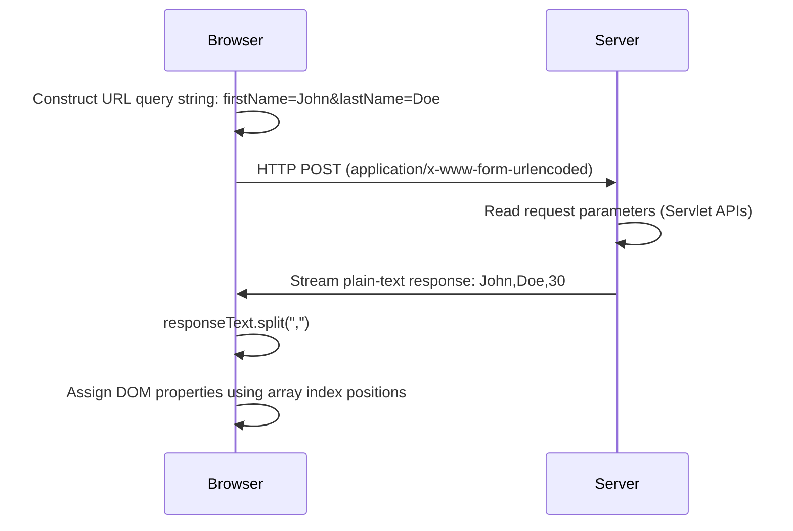
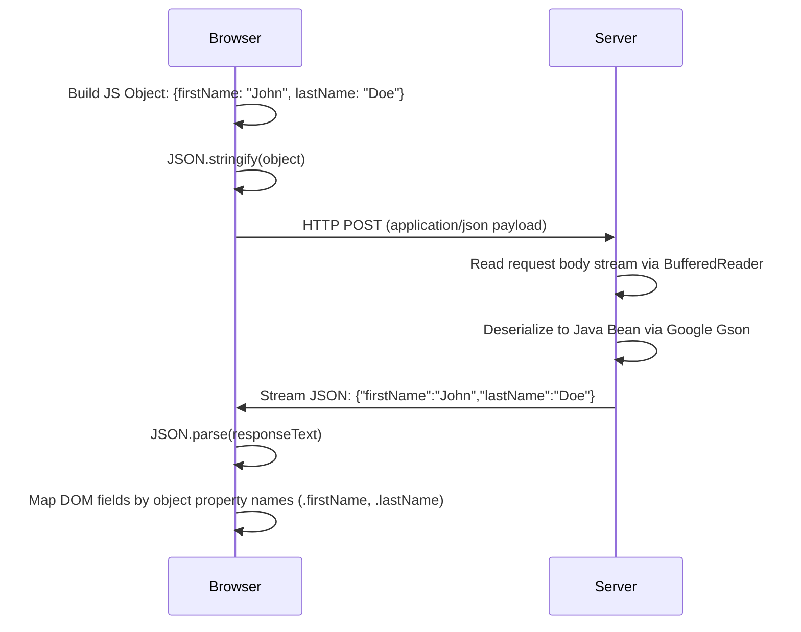

# Architectural Evolution: Delimited Text, JSON, and Promise-Based AJAX

This document outlines the technical evolution and flow of changes observed across the four different AJAX programming styles: `ajaxexamples` (CSV Plain Text), `ajaxexamples2` (Native JSON), `ajaxexamples_jquery` (Library/Promise-based), and `ajaxexamples4` (Native Fetch & Promises).

---

## 1. The AJAX Evolution Matrix

| Paradigm Case | Data Format | Client API | Server Handling | Robustness & Maintenance |
| :--- | :--- | :--- | :--- | :--- |
| **Case 1: Delimited Text** (`ajaxexamples`) | Comma-separated flat string (`text/plain`) | Native `XMLHttpRequest` (events: `onreadystatechange`) | Manual serialization; reads form-urlencoded query parameters. | **Low**: String splits are fragile and break if value fields contain commas. |
| **Case 2: Native JSON** (`ajaxexamples2`) | Structured JSON (`application/json`) | Native `XMLHttpRequest` (events: `onreadystatechange`) | Gson deserialization from request stream; Gson serialization of objects. | **Medium**: Safely handles complex data but client script remains verbose. |
| **Case 3: jQuery AJAX** (`ajaxexamples_jquery`) | Structured JSON (`application/json`) | jQuery `$.ajax` (promises: `.done()`, `.fail()`) | Same JSON servlet backend (with optional Thread delay testing). | **High**: Minimal boilerplate, promise chaining, and simplified global loading indicators. Requires jQuery library. |
| **Case 4: Native Fetch & Promises** (`ajaxexamples4`) | Structured JSON (`application/json`) | Native ES6 `fetch()` API & Promise chains | Same JSON servlet backend. | **High**: Modern clean syntax, zero library dependencies (browser native), promise chaining. |

---

## 2. In-Depth Flow of Changes

### Phase 1: Flat Text/CSV-Delimited Data Flow (`ajaxexamples`)
The earliest style treats communication strictly as unstructured text. 



---

### Phase 2: Native JSON Payload Data Flow (`ajaxexamples2`)
To fix delimiter collisions and allow structured datasets, the project transitioned to JSON.



---

### Phase 3: Promise-Based API and Library Wrappers (`ajaxexamples_jquery` & `ajaxexamples4`)
The final phases resolve code verbosity, decouple external libraries, and leverage modern native web standards.

*   **Replacing Native XHR Boilerplate**:
    Instead of writing multiple state checks for every single request, developers write clean chainable promises:
    ```javascript
    // Clean jQuery:
    $.ajax({ url: "api" }).done(data => { ... });

    // Clean Fetch:
    fetch("api").then(r => r.json()).then(data => { ... });
    ```
*   **Decoupling jQuery Library Dependencies (`ajaxexamples4`)**:
    While jQuery (`$.ajax`) simplifies code, it requires introducing a heavy external library dependency (`jquery.js`). `ajaxexamples4` uses the modern native browser **Fetch API** (`fetch()`) and Promise chains (`.then()`, `.catch()`) to achieve clean, modern asynchronous coding without any external library dependencies.
