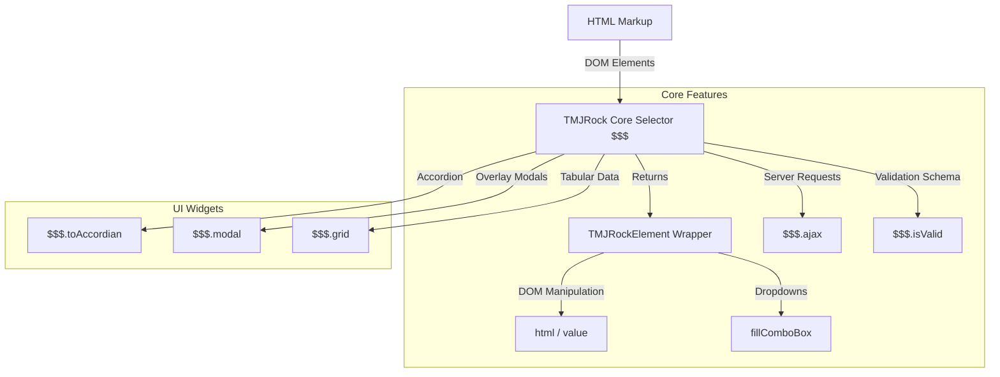

# TMJRock / ROCK-FM Frontend Framework Documentation

This document provides a comprehensive technical overview of the client-side JavaScript utility library **TMJRock** (also referred to as **ROCK-FM**). It covers the architectural design, core library features, API specifications, and details how it compares to standard **jQuery**.

---

## 1. Architectural Philosophy

The TMJRock framework is designed as a lightweight, zero-dependency utility layer for web applications. Its primary design goals are:
* **Simplicity and Direct DOM Wrapping**: Providing a thin wrapper around native HTML elements to ease syntax.
* **Component-Driven Utility**: Coupling core framework logic with integrated, ready-to-use widgets (Modals, Accordions, Grids) and a declarative Validation Engine.
* **Separation of Concerns**: Differentiating between the "Library Developer" (who writes core methods) and the "Library User" (who invokes the utility methods).

### Component Workflow Diagram


---

## 2. Framework Core & API Reference

### 2.1 Element Wrapper (`$$$`)
The foundational element retrieval method uses the triple dollar sign. Depending on the version, it acts as a container namespace or returns a wrapper object:

```javascript
function $$$(cei) {
  let element = document.getElementById(cei);
  if (!element) return null;
  return new TMJRockElement(element);
}
```

#### `TMJRockElement` Methods:
* **`.html(content)`**
  * **Role**: Getter/Setter for element `innerHTML`.
  * **Usage**:
    ```javascript
    let value = $$$("myDiv").html(); // Getter
    $$$("myDiv").html("New Content"); // Setter
    ```
* **`.value(content)`**
  * **Role**: Getter/Setter for form element values.
  * **Usage**:
    ```javascript
    let email = $$$("emailField").value(); // Getter
    $$$("emailField").value("test@example.com"); // Setter
    ```
* **`.fillComboBox(config)`**
  * **Role**: Populates a `<select>` dropdown dynamically from a JSON data source.
  * **Parameters**:
    * `dataSource` (Array of Objects): The raw list of data.
    * `text` (String): The key in the data object to map to the option display text.
    * `value` (String): The key in the data object to map to the option `value` attribute.
    * `firstOption` (Object, optional): Custom default header (e.g. `{"text": "Select Country", "value": "-1"}`).
  * **Validations**: Automatically raises explicit exceptions if types do not match (e.g., calling it on non-`<select>` tags, missing properties, or invalid array data).

---

### 2.2 AJAX Module (`$$$.ajax`)
A wrapper around browser-native `XMLHttpRequest` implementing cross-browser network requests.

```javascript
$$$.ajax({
  url: "servletOne",
  methodType: "GET", // "GET" or "POST"
  data: { key: "value" }, // Query parameters or POST body
  sendJSON: true, // Only for POST. If true, sets application/json; if false, application/x-www-form-urlencoded
  success: function(responseData) { ... },
  failure: function() { ... }
});
```

#### Key Capabilities:
1. **GET Requests**: Automatically constructs query strings from the `data` configuration object and appends them to the URL.
2. **POST Requests**: Supports dual-mode serialization:
   * **JSON Body**: Sends `application/json` payload via `JSON.stringify`.
   * **Url-Encoded Form**: Sends `application/x-www-form-urlencoded` query string.
3. **Auto-Parsing**: Automatically performs `JSON.parse` on the response text before triggering the `success` handler.

---

### 2.3 Form Validation Engine (`$$$.isValid`)
A schema-driven validation module that performs evaluations on DOM inputs and updates target error panes.

```javascript
var registrationValid = $$$.isValid({
  "nm": {
    "required": true,
    "input-size": 20,
    "invalid": "Admin",
    "error-pane": "nmErrorSection",
    "errors": {
      "required": "Name is required.",
      "input-size": "Name cannot exceed 20 characters.",
      "invalid": "Username cannot be Admin."
    }
  }
});
```

#### Supported Validation Rules:
* `required` (Boolean): Ensures the string is not empty or filled only with whitespaces.
* `input-size` (Integer): Restricts maximum characters allowed.
* `invalid` (String/Integer): Prevents default or placeholder values (e.g., `-1` for a city select).
* `required-state` (Boolean): Requires specific boolean checks (e.g. checking an "I Agree" checkbox).
* `error-pane` (String): ID of the element to receive the error messages.
* `display-alert` (Boolean): Triggers a browser fallback alert instead of inline text.

---

### 2.4 UI Components

#### 1. Accordion Control (`$$$.toAccordian`)
Converts structured markup into a collapsible accordion container.
* **Target Structure**:
  ```html
  <div id="myAccordion">
    <h2>Tab Title 1</h2>
    <div>Tab Content 1</div>
    <h2>Tab Title 2</h2>
    <div>Tab Content 2</div>
  </div>
  ```
* **Binding**:
  ```javascript
  $$$.toAccordian("myAccordion");
  ```
* **Logic**: Hides all child `div` containers and maps them to their corresponding `h2` elements. Clicking an `h2` toggles visibility and display styles between `none` / `block`.

#### 2. Modal Utility (`$$$.modal`)
Dynamically creates overlay dialogues out of basic inline HTML blocks.
* **Usage**:
  ```javascript
  $$$.modal("xyz");
  ```
* **Logic**:
  1. Hides the target element initially on page load.
  2. On trigger, assigns absolute viewport styling (`top: 10%; left: 10%; width: 80%; height: 80vh;`).
  3. Spawns and appends a floating close button (`X`) on the top-right of the modal.
  4. Caches the element in a local reference object (`$$$.modalContainer`) to prevent repetitive DOM operations on subsequent interactions.

#### 3. Grid Component (`$$$.grid`)
Renders structured tabular elements out of client-side data models.
* **Usage**:
  ```javascript
  $$$.grid("tableContainer", {
    "model": myDataModel,
    "pagination": true,
    "pageSize": 10,
    "rowSelectionEnable": true
  });
  ```
* **DataModel API**:
  The grid component relies on a strict data source contract. Users must implement these methods:
  * `getRowCount()`: Returns number of rows.
  * `getColumnCount()`: Returns number of columns.
  * `getColumnName(index)`: Returns column header string.
  * `getValueAt(rowIndex, colIndex)`: Returns cell value.
* **Interactive Selection**: If `rowSelectionEnable` is active, clicking rows dynamically swaps class configurations between `.default-row` and `.selected-row` to highlight the current line.

---

## 3. Comprehensive Comparison: TMJRock vs. jQuery

| Metric / Feature | TMJRock / ROCK-FM | jQuery |
| :--- | :--- | :--- |
| **Footprint / Library Size** | Minimal (under 500 lines of plain JS). | Larger (compressed footprint, ~85KB). |
| **Dependencies** | None. | None. |
| **Selectors** | ID-specific `$$$("id")` or name lookup `document.getElementsByName(key)`. | Selector engine (Sizzle) supporting IDs, classes, hierarchies, attributes, and custom filters `$(selector)`. |
| **DOM Manipulation** | Basic wrappers (`.html()`, `.value()`). | Multi-functional methods (`.html()`, `.val()`, `.text()`, `.append()`, `.css()`, `.attr()`, etc.). |
| **Method Chaining** | Partial chaining. Wrappers return objects but widget functions do not. | Extensive. Nearly all jQuery methods return jQuery collections. |
| **AJAX Capability** | Single `$$$.ajax` wrapper covering XMLHttpRequests, with auto-JSON parsing and custom JSON flag. | Rich suite (`$.ajax`, `$.get`, `$.post`, `$.getJSON`) handling promises, custom headers, file uploads, and content settings. |
| **Event Normalization** | Wraps basic native event binds (e.g. `window.addEventListener('load')` via `$$$.onDocumentLoaded`). | Comprehensive cross-browser normalization (`.on()`, `.off()`, `.trigger()`, document-ready shortcuts). |
| **Built-in Widgets** | Modals, Grid Tables, Accordions, and Validation logic are hardcoded directly into the core namespace. | Core does not include widgets. Relies on **jQuery UI** or independent plugins (e.g., jQuery Validation, DataTables). |
| **Extensibility** | Fixed custom structure; extension requires modifying the source elements directly. | Extensible plugin architecture via `$.fn.extend` or `$.extend`. |

---

## 4. Key Takeaways & Best Practices

1. **Integrated Component Model**: While jQuery focuses primarily on query selection and DOM manipulation, TMJRock bundles common application architecture widgets (modals, validation, table grids) in the same namespace, serving as a unified UI utility.
2. **Explicit Data-Checking**: Methods like `fillComboBox` contain strict sanity and type checking. This results in descriptive runtime exceptions that make client-side validation errors straightforward to trace.
3. **Zero Compilation for UI**: Modals and Accordions are generated from standard semantic markup (`<h2>`, `<div>`, `<table>`) without requiring shadow DOM compiles or templating packages, making it highly compatible with basic web servers.
