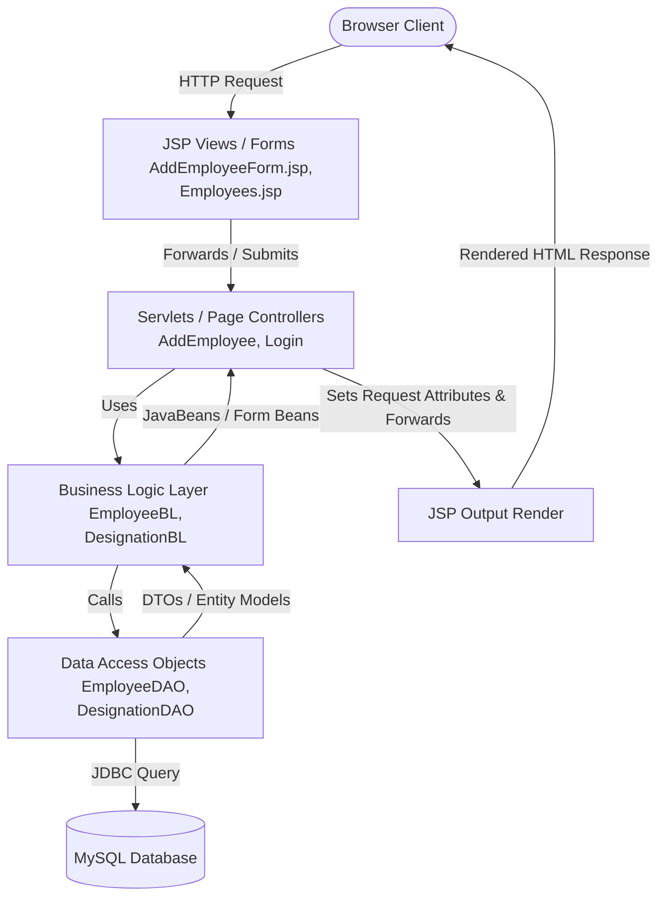

# HR-Nexus: Model 2 (MVC) Architecture & Technical Analysis (styletwo)

This document provides a comprehensive technical analysis and architectural documentation of the **styletwo** project (named **HR-Nexus**). It outlines the architecture pattern, detailed project components, directory structure, known code quality issues, and recommended modern refactoring paths.

---

## 1. Project Basis & Technology Stack

The **styletwo** project is a dynamic, database-driven **Java EE Web Application** that manages employees and designations. It is designed to run in a Servlet Container (such as **Apache Tomcat 9**) using the **Java EE Web Specification (version 4.0)**.

### Core Technology Stack:
*   **Backend Language**: Java SE 8+ (compiled inside [classes](file:///media/ashvin/code/tomcat9/webapps/styletwo/WEB-INF/classes))
*   **Web Framework/Specification**: Servlet 4.0, JavaServer Pages (JSP) 2.3, and Custom Java Server Pages Tag Libraries (TLD).
*   **Database Access**: JDBC (Java Database Connectivity) with MySQL connector driver `mysql.jar`.
*   **Design Paradigm**: Model-View-Controller (MVC) / Model 2 Architecture.
*   **Frontend**: JSP, JSTL/EL (Expression Language), CSS, and client-side JavaScript for DOM manipulation and validations.

---

## 2. Architecture & Design Patterns: Model 2 MVC

Unlike the servlet-centric Model 1 development in **styleone**, **styletwo** implements the **JSP-Servlet Model 2 (MVC)** design pattern. This pattern enforces a strict separation of concerns between request handling, business processing, and content rendering.



### Key Components:

1.  **Model (M)**:
    *   **Data Transfer Objects (DTO)**: Under [com.ashvin.hr.nexus.dl](file:///media/ashvin/code/tomcat9/webapps/styletwo/WEB-INF/classes/com/ashvin/hr/nexus/dl), objects like [EmployeeDTO.java](file:///media/ashvin/code/tomcat9/webapps/styletwo/WEB-INF/classes/com/ashvin/hr/nexus/dl/EmployeeDTO.java) represent database tables and transfer structured data.
    *   **Data Access Objects (DAO)**: Under [com.ashvin.hr.nexus.dl](file:///media/ashvin/code/tomcat9/webapps/styletwo/WEB-INF/classes/com/ashvin/hr/nexus/dl), classes like [EmployeeDAO.java](file:///media/ashvin/code/tomcat9/webapps/styletwo/WEB-INF/classes/com/ashvin/hr/nexus/dl/EmployeeDAO.java) encapsulate raw SQL statements and handle database queries.
    *   **JavaBeans / Form Beans**: Under [com.ashvin.hr.nexus.beans](file:///media/ashvin/code/tomcat9/webapps/styletwo/WEB-INF/classes/com/ashvin/hr/nexus/beans), objects like [EmployeeBean.java](file:///media/ashvin/code/tomcat9/webapps/styletwo/WEB-INF/classes/com/ashvin/hr/nexus/beans/EmployeeBean.java) act as property bags to hold input data and display messages/errors.
    *   **Business Logic (BL)**: Classes under [com.ashvin.hr.nexus.bl](file:///media/ashvin/code/tomcat9/webapps/styletwo/WEB-INF/classes/com/ashvin/hr/nexus/bl) (e.g., [EmployeeBL.java](file:///media/ashvin/code/tomcat9/webapps/styletwo/WEB-INF/classes/com/ashvin/hr/nexus/bl/EmployeeBL.java)) coordinate data processing, mapping DTOs to Beans.

2.  **View (V)**:
    *   Dynamic presentation layers are fully implemented in **JSP pages** (e.g., [Employees.jsp](file:///media/ashvin/code/tomcat9/webapps/styletwo/Employees.jsp) and [Designations.jsp](file:///media/ashvin/code/tomcat9/webapps/styletwo/Designations.jsp)). No HTML is hardcoded or printed inside servlets using Java `PrintWriter`.
    *   Uses JSTL-like dynamic expression expressions (`${messageBean.message}`) to fetch request-scoped attributes.

3.  **Controller (C)**:
    *   Implemented as **Java Servlets** under [com.ashvin.hr.nexus.servlets](file:///media/ashvin/code/tomcat9/webapps/styletwo/WEB-INF/classes/com/ashvin/hr/nexus/servlets) (e.g., [AddEmployee.java](file:///media/ashvin/code/tomcat9/webapps/styletwo/WEB-INF/classes/com/ashvin/hr/nexus/servlets/AddEmployee.java)).
    *   Servlets intercept form data, perform operations, wrap execution responses in Beans, and delegate rendering to corresponding JSP views using `RequestDispatcher.forward()`.

---

## 3. Advanced Features in styletwo

### A. Template Inheritance (Layout Reuse)
Instead of copy-pasting layout elements (headers, footers, navigation sidebars) in each view, the application centralizes the shell inside:
*   [MasterPageTopSection.jsp](file:///media/ashvin/code/tomcat9/webapps/styletwo/MasterPageTopSection.jsp) (Holds `<head>`, logo, navigation sidebar, session validation)
*   [MasterPageBottomSection.jsp](file:///media/ashvin/code/tomcat9/webapps/styletwo/MasterPageBottomSection.jsp) (Holds footer and closing body/html tags)

Other pages use `<jsp:include page="/MasterPageTopSection.jsp" />` at the top and bottom, complying with the **DRY (Don't Repeat Yourself)** principle.

### B. Custom JSP Tag Libraries
The application introduces a custom JSP tag library configured in [tmtags.tld](file:///media/ashvin/code/tomcat9/webapps/styletwo/WEB-INF/taglib/tmtags.tld) under prefix `tm:`. Handlers are implemented under [com.ashvin.hr.nexus.tags](file:///media/ashvin/code/tomcat9/webapps/styletwo/WEB-INF/classes/com/ashvin/hr/nexus/tags):
*   `<tm:ValidateLogin>`: Checks if the user is authenticated in the session. If not, renders forwarding code.
*   `<tm:FormID>`: Prevents double-submission by generating a unique UUID, placing it in the session scope, and injecting a hidden input field.
*   `<tm:FormResubmitted>`: Checks whether the incoming form token was already used (already deleted from the session) and redirects appropriately.
*   `<tm:Module>`: Highlights active modules in the sidebar navigation using numeric scope constants.
*   `<tm:If>`: Evaluates its body if a boolean expression or condition is true.
*   `<tm:EntityList>`: Executes custom reflection-based data retrieval to loop and bind properties from backend layers dynamically inside pages.

### C. Client-Side Templating (JavaScript Injection)
In [Employees.jsp](file:///media/ashvin/code/tomcat9/webapps/styletwo/Employees.jsp) and the dynamic servlet script [Employees.java](file:///media/ashvin/code/tomcat9/webapps/styletwo/WEB-INF/classes/com/ashvin/hr/nexus/servlets/Employees.java), the application reads a template JavaScript file ([Employees.js](file:///media/ashvin/code/tomcat9/webapps/styletwo/WEB-INF/js/Employees.js)) and appends dynamic employee datasets as JavaScript array objects. The client-side code uses `cloneNode(true)` to duplicate template rows, fill in values, and append them dynamically to the DOM on load.

---

## 4. Code Structure & Components

```
styletwo/
├── AddDesignation.jsp         <- JSP endpoint parsing forms to forward to addDesignation servlet
├── AddDesignationForm.jsp     <- Page to input designation name
├── AddEmployee.jsp            <- JSP endpoint parsing forms to forward to addEmployee servlet
├── AddEmployeeForm.jsp        <- Form input for adding an employee
├── ConfirmDeleteDesignation.jsp
├── ConfirmDeleteEmployee.jsp
├── DeleteDesignation.jsp
├── DeleteEmployee.jsp
├── Designations.jsp           <- Views designations using <tm:EntityList>
├── EditDesignationForm.jsp
├── EditEmployeeForm.jsp
├── Employees.jsp              <- Serves template grid structure populated by Employees.js
├── LoginPage.jsp              <- Render user credential forms
├── MasterPageTopSection.jsp   <- Sidebar layout, styling header, & authorization validation
├── MasterPageBottomSection.jsp<- Footer template section
├── Notification.jsp           <- Dynamically styled success redirect page using MessageBean
├── UpdateDesignation.jsp
├── UpdateEmployee.jsp
├── index.jsp                  <- Default welcome landing dashboard page
├── problem.txt                <- Development problem/solution logs
├── styleone_README.md         <- Legacy project review logs
├── css/                       <- Global stylesheets (styles.css, employee.css, designation.css)
├── images/                    <- Logos & assets
├── js/                        <- Client-side script forms (Login.js, AddEmployee.js, etc.)
└── WEB-INF/
    ├── web.xml                <- Standard deployment descriptor mapping servlets
    ├── js/
    │   └── Employees.js       <- JS template base loaded by servlet to inject lists
    ├── taglib/
    │   └── tmtags.tld         <- Tag Library Descriptor config mapping custom JSP tags
    └── classes/
        └── com/ashvin/hr/nexus/
            ├── beans/         <- JavaBeans (EmployeeBean, MessageBean, ErrorBean, etc.)
            ├── bl/            <- Business Logic layer mapping entities (EmployeeBL)
            ├── dl/            <- Data Access Layer (EmployeeDAO, DTOs, & DB Connector)
            ├── servlets/      <- Controller Servlets routing requests and processing CRUD
            └── tags/          <- Custom Jsp Tag Handlers executing rendering controls
```

---

## 5. Structural & Code Issues (Not Bugs)

While MVC separation is achieved, the codebase retains several legacy patterns and bad practices:

### A. Persistent Connection Leaks in DAOs
Just like `styleone`, **styletwo** does not close connections in a `finally` block or use **Try-with-Resources**.
*   **The Issue**: If a `SQLException` occurs inside `try` blocks in [EmployeeDAO.java](file:///media/ashvin/code/tomcat9/webapps/styletwo/WEB-INF/classes/com/ashvin/hr/nexus/dl/EmployeeDAO.java) or [DesignationDAO.java](file:///media/ashvin/code/tomcat9/webapps/styletwo/WEB-INF/classes/com/ashvin/hr/nexus/dl/DesignationDAO.java) (e.g. database constraints, unique key failures, syntax errors), execution jumps directly to `catch`, bypassing the `.close()` calls. Under high traffic, this exhausts connection resources quickly.
*   **Affected files**: `EmployeeDAO.java`, `DesignationDAO.java`, `AdministratorDAO.java`.

### B. Hardcoded Environments & Database Configuration
*   **The Issue**: Database connectivity details (driver class, URL, username, password) are hardcoded inside [DAOConnection.java](file:///media/ashvin/code/tomcat9/webapps/styletwo/WEB-INF/classes/com/ashvin/hr/nexus/dl/DAOConnection.java). Moving the database requires rebuilding the classes and redeploying.

### C. Deprecated Reflection API Methods
*   **The Issue**: Inside [EntityListTagHandler.java](file:///media/ashvin/code/tomcat9/webapps/styletwo/WEB-INF/classes/com/ashvin/hr/nexus/tags/EntityListTagHandler.java#L59), dynamic instantiation is handled via `Class.newInstance()`:
    ```java
    Object obj=c.newInstance();
    ```
    This method has been deprecated since Java 9. Modern Java expects `c.getDeclaredConstructor().newInstance()`.

### D. Generic Type Warnings
*   **The Issue**: [EntityListTagHandler.java](file:///media/ashvin/code/tomcat9/webapps/styletwo/WEB-INF/classes/com/ashvin/hr/nexus/tags/EntityListTagHandler.java#L11) defines `private List<Class> list;` but uses it to store a list of business objects (like `EmployeeBean` or `DesignationBean`). This triggers compiler warnings and runs against standard generic typing.

### E. Redundant Client-Side Loop Traversal
*   **The Issue**: In [Employees.jsp](file:///media/ashvin/code/tomcat9/webapps/styletwo/Employees.jsp) combined with [Employees.js](file:///media/ashvin/code/tomcat9/webapps/styletwo/WEB-INF/js/Employees.js):
    1.  The backend loops through list entries in `Employees.java` to print Javascript code line-by-line.
    2.  The frontend loads, parses, and loops over the generated Javascript array a second time to inject text elements into the DOM template.
    This dual-loop pattern is highly inefficient compared to serving clean JSON objects.

### F. Typo in JS Template File
*   **The Issue**: On line 102 in [Employees.js](file:///media/ashvin/code/tomcat9/webapps/styletwo/WEB-INF/js/Employees.js#L102):
    ```javascript
    if(placeHolderFor=="panNumber") cellTemplate.innerHTML=emloyees[i].panNumber;
    ```
    The variable `employees[i]` is misspelled as `emloyees[i]`. In runtime execution, this causes a reference error, causing the page load script to fail or omit rendering employee PAN numbers.


## 5. Architectural & Structural Design Limitations

While MVC separation is achieved, **styletwo** contains several architectural and structural design limitations:

### A. Lack of AJAX / Full Page Reloads
Every user interaction, navigation, form submission, and validation error triggers a complete HTTP request-response cycle and full page redraw.
*   **The Issue**: There is no asynchronous client-server communication (AJAX) or Single Page Application (SPA) structure. When an action is taken (e.g., submitting a designation, validating credentials, or updating tables), the entire page flashes and reloads. This creates a sluggish user experience, leads to unnecessary server-side rendering overhead, and consumes more network bandwidth.

### B. Tight Coupling of Frontend and Backend Services
*   **The Issue**: The client-side components are tightly coupled to the Java servlet container. For example, instead of serving standard JSON endpoints, the backend servlet [Employees.java](file:///media/ashvin/code/tomcat9/webapps/styletwo/WEB-INF/classes/com/ashvin/hr/nexus/servlets/Employees.java) dynamically reads a client-side JavaScript file, appends Java data to it, and writes it directly as an HTTP response. This prevents the frontend from being hosted statically on separate CDN servers and blocks independent scaling of front-end and back-end logic.

### C. Redundant Data Traversal (Dual-Traversal Loop)
*   **The Issue**: Generating the employee list requires two separate traversal loops. First, the backend Java Servlet loops through all employee records from the database to dynamically write JavaScript object creation statements. Second, the client browser receives this generated script and must loop through the populated JavaScript array again to clone DOM nodes and render the table. This double-loop structure introduces unnecessary CPU cycles on both the server and client.

### D. Direct Database Resource Management (No Connection Pool)
*   **The Issue**: Every database request calls `DriverManager.getConnection()`, which performs a raw network handshake with the MySQL database to establish a new connection. Without a Managed Connection Pool (like HikariCP), the application suffers from latency bottlenecks under production loads because connection creation is highly resource-intensive.

### E. Manual Dependency Instantiation (No Inversion of Control)
*   **The Issue**: Standard components and services are instantiated manually inside controllers and services using the `new` keyword (e.g., `new EmployeeDAO()`). This lack of Dependency Injection (DI) makes it difficult to swap database implementations, mock dependencies for unit testing, or manage component lifecycles cleanly.


---

## 6. Modern Refactoring Strategies

To elevate **styletwo** to production-grade standards, the following refactoring steps should be taken:

1.  **Introduce a Build Automation Tool**:
    *   Integrate **Maven** or **Gradle** to manage dependencies (like MySQL connectors and JSTL tags) and standardize compilation and deployment tasks.
2.  **Enable Database Connection Pooling & JNDI**:
    *   Replace `DriverManager` in `DAOConnection` with a robust connection pool provider like **HikariCP** or a server-managed JNDI `DataSource`. Externalize configuration into a properties file (e.g., `db.properties` or environment variables).
3.  **Implement Safe JDBC Resource Management**:
    *   Refactor all database operations inside DAOs to use Java 7+ **Try-with-Resources**. This guarantees resource termination of `Connection`, `PreparedStatement`, and `ResultSet` regardless of successes or exceptions.
    ```java
    try (Connection connection = DAOConnection.getConnection();
         PreparedStatement preparedStatement = connection.prepareStatement("...")) {
        // execute operations
    } catch (SQLException e) {
        throw new DAOException(e.getMessage(), e);
    }
    ```
4.  **Adopt Spring Boot & Spring Data JPA**:
    *   Transition the raw JDBC layer and custom DAO classes to Spring Data JPA (`CrudRepository` or `JpaRepository`). This eliminates boilerplate query statements and database leaks entirely.
    *   Migrate servlet controller structures to Spring Web MVC `@Controller` or `@RestController`.
5.  **Expose Standard JSON APIs**:
    *   Instead of dynamically writing JS scripts from servlets, expose data endpoints returning clean JSON data.
    *   The frontend can consume this using the modern native JavaScript `fetch()` API, completely decoupling the server-side templating layer.
