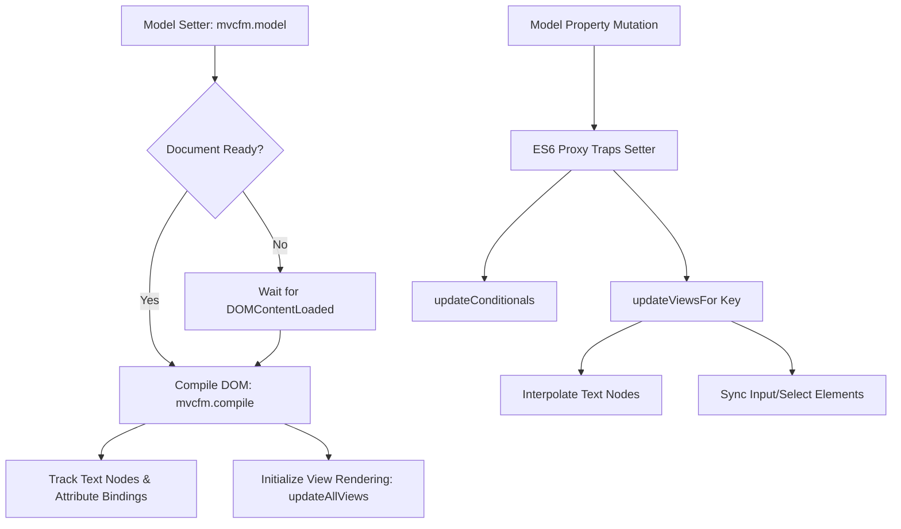

# Technical Documentation: MVCFM Reactive Architecture


## 1. Core Architecture and Reactivity Engine

The framework uses an event-driven reactive programming model. Instead of scanning the DOM repeatedly or replacing node structures destructively, it wraps the data store in a recursive ES6 Proxy and compiles references to the DOM nodes.



### 1.1. Deep Reactive Proxying
Properties within the model are monitored using a proxy handler. If a property value is modified programmatically or through user interaction, the setter interceptor triggers an UI update.

```javascript
mvcfm.createProxy = function(obj, path = "") {
  const self = this;
  if (typeof obj !== "object" || obj === null) return obj;

  // Intercept Array mutation methods
  if (Array.isArray(obj)) {
    for (let i = 0; i < obj.length; i++) {
      if (typeof obj[i] === "object" && obj[i] !== null) {
        obj[i] = self.createProxy(obj[i], `${path}[${i}]`);
      }
    }
    return new Proxy(obj, {
      get(target, prop, receiver) {
        const value = Reflect.get(target, prop, receiver);
        if (typeof value === 'function' && ['push', 'pop', 'shift', 'unshift', 'splice', 'reverse', 'sort'].includes(prop)) {
          return function(...args) {
            const result = value.apply(target, args);
            self.updateViewsFor(path, target);
            self.updateConditionals();
            return result;
          }
        }
        return value;
      },
      set(target, prop, value, receiver) {
        const result = Reflect.set(target, prop, value, receiver);
        self.updateViewsFor(path, target);
        self.updateConditionals();
        return result;
      }
    });
  }

  // Intercept standard Object properties
  for (let key in obj) {
    if (typeof obj[key] === "object" && obj[key] !== null) {
      obj[key] = self.createProxy(obj[key], path ? `${path}.${key}` : key);
    }
  }

  return new Proxy(obj, {
    set(target, property, value, receiver) {
      const oldVal = target[property];
      const result = Reflect.set(target, property, value, receiver);
      if (oldVal !== value) {
        const fullPath = path ? `${path}.${property}` : property;
        self.updateViewsFor(fullPath, value);
        self.updateConditionals();
      }
      return result;
    }
  });
};
```

---

## 2. Key Framework Features

### 2.1. Non-Destructive Interpolation (`{{key}}` Rendering)
To prevent the loss of template markers when values change, the compile phase caches the original template string as a custom property (`originalText`) on the DOM text nodes.

```javascript
// During compile phase:
if (node.nodeType === Node.TEXT_NODE) {
  const text = node.nodeValue;
  if (text.includes("{{") && text.includes("}}")) {
    node.originalText = text; // Persist the template string
    self.textNodes.push(node);
  }
}
```
During updates, the framework evaluates variables against this cached template, preserving the markers for future updates:
```javascript
mvcfm.interpolateTextNode = function(node) {
  const self = this;
  let text = node.originalText;
  const matches = text.match(/\{\{\s*([\w\.]+)\s*\}\}/g);
  if (matches) {
    matches.forEach(match => {
      const propPath = match.replace(/[\{\}\s]/g, "");
      const val = self.resolvePath(self.model, propPath);
      text = text.replace(match, Array.isArray(val) ? JSON.stringify(val) : (val !== undefined ? val : ""));
    });
  }
  node.nodeValue = text;
};
```

### 2.2. Secure Conditional Directive (`mvcfm-if`)
Rather than relying on `eval()`, which risks XSS and scope resolution issues, conditional evaluations are performed within an isolated function context where only the model's properties are passed as scoped arguments.

```javascript
mvcfm.updateConditionals = function() {
  const self = this;
  self.ifElements.forEach($elem => {
    const expr = $elem.attr("mvcfm-if");
    try {
      const keys = Object.keys(self.model || {});
      const values = Object.values(self.model || {});
      // Create isolated scope passing model values as formal arguments
      const func = new Function(...keys, `return (${expr});`);
      const result = func.apply(null, values);
      if (result) {
        $elem.show('slow');
      } else {
        $elem.hide('fast');
      }
    } catch (e) {
      console.error("Failed to evaluate mvcfm-if: " + expr, e);
    }
  });
};
```

### 2.3. Safe Asynchronous Controller Invocation (`mvcfm-click`)
Click handlers safely detect return types. If the controller action is asynchronous (returns a Promise), `.then()` handlers are attached. If it is synchronous, execution completes without throwing a runtime error.

```javascript
const result = Reflect.apply(func, self.controller, []);
if (result && typeof result.then === 'function') {
  result.then(
    (res) => { if (res) alert("Success: " + JSON.stringify(res)); },
    (err) => { if (err) alert("Error: " + JSON.stringify(err)); }
  );
}
```

---

## 3. Review of Resolved Bugs and Code Fixes

| Issue Reference | Failure in Critique | Solution in `eg8.html` |
| :--- | :--- | :--- |
| **Race Condition** | Framework DOM ready ran before user window load event, resulting in `null` model bindings. | Setter intercepts assignments and schedules compilation immediately if DOM is parsed, or defers to `DOMContentLoaded`. |
| **Destructive Replaces** | Interpolation replaced text nodes directly, destroying `{{key}}` markers permanently. | Caches the raw expression string on the text node's `originalText` property for reuse. |
| **eval() Usage** | Global `eval` was used for `mvcfm-if`, leading to security concerns and global variable leak. | Dynamic `Function` constructor mapping model keys to variables isolates evaluation scope. |
| **Reflect.apply** | `{}` was passed as arguments list, causing a `TypeError`. | Replaced `{}` with an empty array `[]` representing the parameter list. |
| **URL Templates** | Double quotes were used for strings containing `${queryString}`, making queries non-functional. | Replaced double-quoted strings with backticks (`` `...` ``). |
| **Constructor Typos** | Class constructor misspelled as `contructor`. | Corrected spelling to `constructor` in the `Student` class definition. |
| **Dynamic Option Injections**| Prepended placeholder options on every match check, polluting select tags. | Added checks (`find("option[value='-1']")`) to ensure at most one disabled placeholder option is added. |
| **Endpoint Coupling** | Hardcoded endpoint paths like `StudentManager/add`. | Parameterized routes to resolve against a configurable `baseUrl`. |

---

## 4. Usage Guidelines

### 4.1. Initializing the Model
Always structure variables that control the view state (like flags for conditional visibility) inside the model object. This registers them in the reactivity tree:
```javascript
var ds = {
  "mode": "", // UI state variable
  "name": "Kumar",
  "interest": ["music"]
};

window.addEventListener('load', function() {
  mvcfm.model = ds; // Triggers DOM compilation and bindings
});
```

### 4.2. Programmatic Updates
To update any part of the UI, assign properties directly onto the model object. The framework interceptors will update matching text nodes and form inputs:
```javascript
// Updates the input field value and text nodes containing {{name}}
ds.name = "New Name";

// Mutating array variables triggers checkbox group refreshes automatically
ds.interest.push("coding");
```
