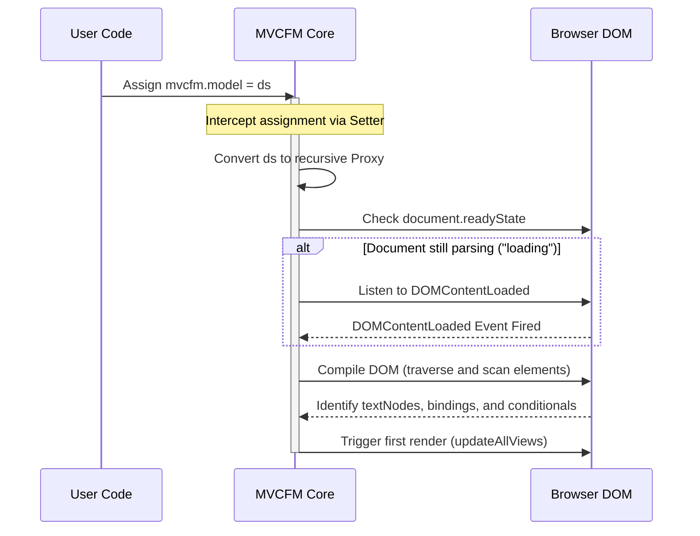

# MVCFM Framework Documentation

Welcome to the MVCFM (Model-View-Controller Framework for Client-side) developer documentation. This guide details the structure, lifecycle, and operations of the framework.

---

## Part 1: Architectural Overview & Lifecycle

MVCFM is a client-side JavaScript framework inspired by Angular's declarative view bindings and Spring Boot's controller-driven architecture. It allows developers to build structured, reactive client-side applications using plain HTML and ES6 classes.

### 1.1. Core Components

MVCFM is structured around three primary pillars:

| Component | Responsibility | Developer Interface |
| :--- | :--- | :--- |
| **Model** | Holds the application state, reactive flags, and form data. | Managed via `mvcfm.model` |
| **View** | The HTML template containing data bindings, event declarations, and expressions. | Declared using `mvcfm-*` attributes and `{{key}}` syntax |
| **Controller** | Contains business logic, AJAX requests, and state transition actions. | Managed via `mvcfm.controller` |

```
                +----------------------------+
                |         Controller         |
                | (e.g., StudentManager class)|
                +-------------+--------------+
                              |
                     Invokes methods via
                     mvcfm-click events
                              |
                              v
+------------+  Reactive updates via  +------------+
|   Model    +=======================>+    View    |
| (data store|   recursive Proxies    |   (HTML    |
|   "ds")    +<-----------------------+  Template) |
+------------+  User inputs sync via  +------------+
                   mvcfm-attribute
```

---

### 1.2. The Initialization Lifecycle

A critical aspect of MVCFM is its compile and link pipeline. To prevent timing issues and data mismatches, the framework implements a deferred initialization lifecycle.

#### 1.2.1. The Initialization Problem
In traditional script loads, the framework initialization (such as binding selectors) may run before the developer has defined or assigned the data model. If the framework runs at `DOMContentLoaded` (document ready) and the user assigns the model during `window.onload` (which fires later), the framework will fail to bind anything because the model is still `null`.

#### 1.2.2. The Deferred Compilation Solution
MVCFM resolves this by intercepting assignments to `mvcfm.model` using `Object.defineProperty`. The moment the developer assigns the data store, the framework executes the compilation:

1. **State Registration**: The model object is converted into a reactive Proxy.
2. **Compilation**: The framework traverses the DOM tree starting from `document.body`.
3. **Binding Linkage**: Form elements, text nodes, and directives are mapped to specific model keys.
4. **First Render**: All registered bindings and conditionals are synced with their initial model values.



---

## Part 2: Reactivity & Two-way Data Binding

The core value of MVCFM lies in its synchronization engine, which ensures that changes in the model instantly update the view, and user inputs instantly update the model.

### 2.1. The Proxy-Based Reactivity Engine

Reactivity is achieved by wrapping the raw model object (`ds`) inside a recursive JavaScript `Proxy`. The proxy intercepts `set` operations on properties and triggers targeted re-renders.

#### 2.1.1. Deep Reactive Proxying
To ensure nested objects are reactive, `mvcfm.createProxy` recursively traverses the data store structure. Each nested object receives its own proxy instance, linked to its parent property path:

* **Object Set Traps**: Intercept assignments to properties. If the new value differs from the old one, `updateViewsFor` and `updateConditionals` are invoked.
* **Array Mutation Interception**: Standard arrays do not trigger a typical `set` operation when mutated via methods like `push()` or `pop()`. To make array updates reactive, the framework intercepts array mutators. When these methods are called, the framework executes the mutation and then forces a refresh on any UI element bound to that array's path.

---

### 2.2. Two-Way Data Binding (`mvcfm-attribute`)

Two-way data binding connects input elements in the DOM to properties in the model. This is declared using the `mvcfm-attribute` attribute.

#### 2.2.1. View-to-Model Propagation
During the DOM compilation phase, event listeners are registered on elements with the `mvcfm-attribute` attribute:
* **Standard Inputs (text, number, email)**: Listen to `input` and `change` events, mapping the value back to the model.
* **Radio Groups**: Listen to the `change` event. When checked, the value is written to the bound model property.
* **Checkboxes**: Handle three distinct data structures:
  1. *Boolean*: Bind directly to the `checked` state (`true` or `false`).
  2. *Array*: Checkboxes share an attribute key. Checking/unchecking adds/removes elements from the model's array.
  3. *String*: Bind to a single string value (checked maps to the value, unchecked maps to `""`).

#### 2.2.2. Model-to-View Propagation
When a model property changes, the proxy invokes `updateInputsFor(key, value)`. This maps the new value back to the correct DOM properties (e.g. setting `.val()` or toggling `.prop('checked', true)`).

---

### 2.3. String Interpolation (`{{key}}`)

String interpolation allows displaying model values dynamically within text nodes.

#### 2.3.1. Compilation and the Caching Strategy
During compilation, text nodes are scanned. If a node contains the template pattern `{{key}}`, the node is registered. Instead of replacing the template text destructively (which would lose the `{{key}}` syntax for subsequent updates), the framework caches the original template string directly on the text node object as `node.originalText`.

#### 2.3.2. Non-Destructive Rendering
When an update is triggered, the framework reads the cached `node.originalText`, extracts the variable keys, resolves their current value in the model, and updates `node.nodeValue`. The original structure in `node.originalText` remains unchanged.

---

## Part 3: Controller & Event Mechanism

MVCFM supports binding user interactions to controller actions. The controller acts as the intermediate layer between the model, view, and the server/database.

### 3.1. Controller Registration

A controller is declared as an ES6 class containing methods and data fetching handlers. It is registered by assigning an instance of the class to the framework namespace:

```javascript
mvcfm.controller = new StudentManager('StudentManager');
```

---

### 3.2. Dynamic Method Execution (`mvcfm-click`)

Elements in the DOM can register click event handlers that invoke controller methods dynamically. This is declared using the `mvcfm-click` attribute:

```html
<button type="button" mvcfm-click="add">Submit</button>
```

#### 3.2.1. Compilation and Event Setup
During DOM compilation, the framework scans for elements containing the `mvcfm-click` attribute. For each element:
1. It registers a jQuery `click` event listener.
2. When triggered, it prevents the default browser behavior using `ev.preventDefault()`.
3. It retrieves the target method name defined in the `mvcfm-click` attribute value.

#### 3.2.2. Reflective Invocation
The framework dynamically resolves the method on the controller instance using the ES6 Reflection API. 
* **Method Resolution**: `Reflect.get(mvcfm.controller, methodName)` verifies that the controller defines the action.
* **Method Invocation**: `Reflect.apply(func, mvcfm.controller, argumentsList)` executes the method in the context of the controller instance. The arguments list must be a valid array-like object (passed as `[]` if no parameters are required).

---

### 3.3. Asynchronous Execution and Promise Safety

Controller actions often interact with remote APIs using asynchronous operations (e.g., `fetch` or `XMLHttpRequest`).

#### 3.3.1. Promise Handling
If the invoked controller method returns a JavaScript `Promise` (such as from a fetch call), the framework automatically registers `.then()` callback handlers. This provides hooks to capture the asynchronous return and show user feedback alerts upon success or failure:

```javascript
const result = Reflect.apply(func, self.controller, []);
if (result && typeof result.then === 'function') {
  result.then(
    (res) => { if (res) alert("Success: " + JSON.stringify(res)); },
    (err) => { if (err) alert("Error: " + JSON.stringify(err)); }
  );
}
```

#### 3.3.2. Synchronous Execution Safety
If a controller action is synchronous and does not return a Promise (or returns `undefined`), the framework checks that the returned value is a Promise before calling `.then()`, preventing runtime null pointer/type exceptions.

---

### 3.4. Decoupling API Endpoints
To make controllers reusable across different routes and environments, API endpoints are parameterized inside the class constructor rather than hardcoded. The class constructor takes a `baseUrl` string and formats all endpoint URLs dynamically:

```javascript
class StudentManager {
  constructor(baseUrl = 'StudentManager') {
    this.baseUrl = baseUrl;
  }

  add() {
    return new Promise((resolve, reject) => {
      const xhr = new XMLHttpRequest();
      xhr.open("POST", `${this.baseUrl}/add`);
      // ...
    });
  }
}
```

---

## Part 4: Directives & Conditional Rendering

MVCFM supports conditional element rendering through the declarative `mvcfm-if` directive. This allows elements to be shown or hidden dynamically based on logical expressions.

### 4.1. The `mvcfm-if` Attribute

The conditional rendering directive is declared as an attribute on any HTML element. The attribute value contains a JavaScript logical expression:

```html
<div id="addForm" mvcfm-if="mode=='A'">
  <!-- Content displayed only if mode is 'A' -->
</div>
```

---

### 4.2. Secure Sandbox Scope Execution

Traditional implementations often utilize `eval(expression)` to evaluate dynamic attributes. However, `eval()` executes within the current local closure, leading to scoping conflicts, and presents vulnerability pathways if template strings contain unvalidated user inputs.

To mitigate this, MVCFM executes expressions inside a dynamically constructed function that limits variable resolution to model properties.

#### 4.2.1. Variable Parameterization
During evaluation, the framework extracts the keys and values of the reactive model:
```javascript
const keys = Object.keys(self.model || {});
const values = Object.values(self.model || {});
```

#### 4.2.2. Isolated Evaluation
Using the JavaScript `Function` constructor, the keys are passed as formal argument names. The expression is appended as the body return statement. The values are then applied as inputs to this isolated context:
```javascript
const func = new Function(...keys, `return (${expr});`);
const result = func.apply(null, values);
```
If the model contains `{"mode": "A"}`, the compiled function behaves as:
```javascript
function (mode) {
  return (mode == 'A');
}
```
Executing this returns `true`, and does not allow references to resolve against arbitrary global properties or closure scopes.

---

### 4.3. Reactive Visibility Updates

1. During the DOM compile phase, elements with the `mvcfm-if` attribute are pushed to the `ifElements` tracking collection.
2. Whenever a model setter is invoked (indicating a data change), the proxy intercepts the mutation.
3. The setter executes `updateConditionals()`.
4. The framework iterates over the tracked elements, re-evaluates their expressions against the updated model values, and dynamically updates element visibility using jQuery's `.show('slow')` and `.hide('fast')` transition animations.

---

## Part 5: Complete Walkthrough (Example 8)

This section provides a step-by-step developer tutorial on how to construct a fully reactive interface using the corrected MVCFM code from [eg8.html](file:///media/ashvin/code/tryout/mvcfm/eg8.html).

### 5.1. Step 1: Defining the Reactive Model and Controller

To begin, define the global data store (`ds`) containing all variables required for inputs, labels, and rendering checks. Under the window load event, register the model and controller:

```javascript
// 1. Declare the data store
var ds = {
  "mode": "",
  "rollNumber": 101,
  "name": "Kumar",
  "gender": "F",
  "isIndian": true,
  "interest": ["music", "sports"],
  "city": "indore"
};

// 2. Initialize MVCFM on load
window.addEventListener('load', function() {
  mvcfm.model = ds;                         // Triggers proxy conversion & DOM compile
  mvcfm.controller = new StudentManager();  // Binds event handler actions
});
```

---

### 5.2. Step 2: Creating the HTML Form View

Create a form template bound to the model properties using the `mvcfm-attribute` attributes. The visibility is controlled dynamically by the `mvcfm-if` directive.

```html
<!-- Form displays/hides when ds.mode changes -->
<div id="addForm" mvcfm-if="mode=='A'">
  Number: <input type="number" mvcfm-attribute="rollNumber"><br>
  Name: <input type="text" mvcfm-attribute="name"><br>
  
  Gender:
  Male <input type="radio" name="gender" mvcfm-attribute="gender" value="M">
  Female <input type="radio" name="gender" mvcfm-attribute="gender" val="F" mvcfm-bind-to="val"><br>

  <!-- Button click invokes the controller's add() method -->
  <button type="button" mvcfm-click="add">Submit Form</button>
</div>
```

---

### 5.3. Step 3: Implementing Live String Interpolation

Embed string interpolation markers (`{{key}}`) in standard text nodes. As the user typing changes the values in the inputs, the text node values are updated instantly.

```html
<div>
  <p><strong>Roll Number:</strong> {{rollNumber}}</p>
  <p><strong>Name:</strong> {{name}}</p>
  <p><strong>Interests:</strong> {{interest}}</p>
  <p><strong>Current Mode:</strong> {{mode}}</p>
</div>
```

---

### 5.4. Step 4: Programmatic State Mutability

Reactivity is two-way. When properties or arrays in the model are modified programmatically via standard JavaScript, the UI updates automatically.

```javascript
// Toggles the visibility of the form by updating the model mode
function setAddMode() {
  ds.mode = "A"; // Triggers updateConditionals() -> Form is shown with transition
}

// Modifying array variables pushes changes through the Array Proxy
function addCodingHobby() {
  if (!ds.interest.includes("coding")) {
    ds.interest.push("coding"); // Triggers updateViewsFor() -> Checked state of 'coding' checkbox updates
  }
}
```

This completes the implementation guide for MVCFM. Developers can refer to [eg8.html](file:///media/ashvin/code/tryout/mvcfm/eg8.html) for the final, consolidated codebase.
