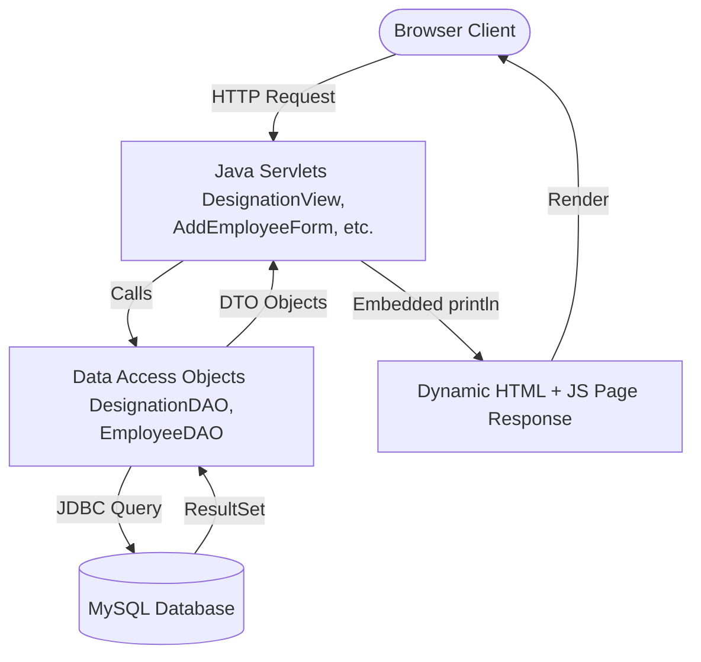

# HR-Nexus: Legacy Architecture Review & Technical Analysis

This document provides a detailed technical analysis of the **styleone** project (named **HR-Nexus**), explaining the programming paradigm used, the project structure, design constraints, and structural issues. It also outlines recommendations for refactoring this project using modern web development practices.

---

## 1. Project Basis & Technology Stack

The **HR-Nexus** project is a dynamic, database-driven **Java Web Application** designed to manage employees and designations. It is designed to be packaged as a standard Web Application Archive (`.war`) and hosted on a Servlet container like **Apache Tomcat 9**.

### Core Technologies Used:
*   **Backend Language**: Java SE 8+ (compiled to `.class` bytecode in the [classes](file:///media/ashvin/code/tomcat9/webapps/styleone/WEB-INF/classes) folder).
*   **Web Specification**: Java EE / Jakarta EE Servlets (version 4.0, defined in [web.xml](file:///media/ashvin/code/tomcat9/webapps/styleone/WEB-INF/web.xml)).
*   **Database Connectivity**: JDBC (Java Database Connectivity) with a MySQL database connector.
*   **Frontend Technologies**: Vanilla HTML5, vanilla JavaScript (client-side form validation and dynamic data views), and inline CSS for layout and presentation.

---

## 2. The Programming Paradigm: Legacy "Model 1" Servlet Development

The architecture of this project represents a **late 1990s to early 2000s web development style**.



### Key Architectural Concepts:
1.  **View Embedded in Controller (Servlet-Centric Rendering)**:
    Rather than using a templating engine (like JSP, Thymeleaf, or Freemarker) or a frontend framework (like React or Vue), the view is compiled directly inside the servlet code. Java's `PrintWriter` is used to output HTML, CSS, and client-side JavaScript line-by-line via `pw.println(...)`.
    *Example from [EmployeeView.java](file:///media/ashvin/code/tomcat9/webapps/styleone/WEB-INF/classes/com/ashvin/hr/nexus/servlets/EmployeeView.java#L95-L102):*
    ```java
    pw.println("<body>");
    pw.println("<!-- Main content start here -->");
    pw.println("<div style='width:90hw;height:95vh;border:1px solid black'>");
    ```

2.  **DTO/DAO Pattern (Data Layer Separation)**:
    The project does follow a good design practice of separating data operations:
    *   **DTO (Data Transfer Object)**: [DesignationDTO.java](file:///media/ashvin/code/tomcat9/webapps/styleone/WEB-INF/classes/com/ashvin/hr/nexus/dl/DesignationDTO.java) and [EmployeeDTO.java](file:///media/ashvin/code/tomcat9/webapps/styleone/WEB-INF/classes/com/ashvin/hr/nexus/dl/EmployeeDTO.java) hold structural database properties with getters and setters.
    *   **DAO (Data Access Object)**: [DesignationDAO.java](file:///media/ashvin/code/tomcat9/webapps/styleone/WEB-INF/classes/com/ashvin/hr/nexus/dl/DesignationDAO.java) and [EmployeeDAO.java](file:///media/ashvin/code/tomcat9/webapps/styleone/WEB-INF/classes/com/ashvin/hr/nexus/dl/EmployeeDAO.java) contain the raw SQL queries and JDBC mapping code.

3.  **Manual HTML Mockup & Translation**:
    The static templates like [AddEmployeeTemplate.html](file:///media/ashvin/code/tomcat9/webapps/styleone/AddEmployeeTemplate.html) and [EmployeeViewTemplate.html](file:///media/ashvin/code/tomcat9/webapps/styleone/EmployeeViewTemplate.html) serve as "blueprints". The static markup was developed and tested first, then translated manually into `pw.println()` statements inside the servlets.

---

## 3. Structural Problems with This Programming Style

While functional, this approach has several critical drawbacks in terms of maintainability, performance, security, and scalability.

### A. Severe Code Redundancy (Violation of DRY Principle)
Every servlet class duplicates the layout boilerplate, header, sidebar navigation, CSS styling, and footer.
*   **The Problem**: If you want to change the navigation menu links or update the footer year (e.g., from `2025` to `2026`), you must edit the HTML code inside **every single Java Servlet file** in the codebase, recompile the classes, and redeploy the web application.
*   **Affected Files**: [DesignationView.java](file:///media/ashvin/code/tomcat9/webapps/styleone/WEB-INF/classes/com/ashvin/hr/nexus/servlets/DesignationView.java), [EmployeeView.java](file:///media/ashvin/code/tomcat9/webapps/styleone/WEB-INF/classes/com/ashvin/hr/nexus/servlets/EmployeeView.java), [AddEmployeeForm.java](file:///media/ashvin/code/tomcat9/webapps/styleone/WEB-INF/classes/com/ashvin/hr/nexus/servlets/AddEmployeeForm.java), etc.

### B. Tight Coupling (No Separation of Concerns)
In modern web engineering, the presentation layer (HTML/CSS), application control logic, and client-side scripts are decoupled.
*   **The Problem**: In this codebase, HTML elements, inline styles, client-side validation JavaScript, and Java controller code are mixed together. For instance, [AddEmployeeForm.java](file:///media/ashvin/code/tomcat9/webapps/styleone/WEB-INF/classes/com/ashvin/hr/nexus/servlets/AddEmployeeForm.java#L24-L98) outputs more than 70 lines of string-encoded JavaScript inside the servlet code. This makes debugging syntax errors in CSS or JS extremely difficult since the compiler cannot validate string literals.

### C. Database Connection Leaks (Critical Resource Bug)
In the DAOs, JDBC resource cleanup is performed inside the main `try` block.
*   **The Problem**: If an exception occurs during query execution (such as a database timeout or syntax error), the execution flow immediately jumps to the `catch` block. The `.close()` calls are bypassed, leaking the connection. Under production loads, this quickly exhausts the database connection pool, rendering the app completely unresponsive.
*   **Affected Code snippet from [DesignationDAO.java](file:///media/ashvin/code/tomcat9/webapps/styleone/WEB-INF/classes/com/ashvin/hr/nexus/dl/DesignationDAO.java#L7-L46)**:
    ```java
    try {
        Connection connection = DAOConnection.getConnection();
        // ... (queries executed here)
        preparedStatement.close();
        connection.close(); // Bypassed if SQLException is thrown!
    } catch(SQLException sqlException) {
        throw new DAOException(sqlException.getMessage());
    }
    ```

### D. Hardcoded Environments (Static Data Configuration)
All database connection configurations are compiled directly into [DAOConnection.java](file:///media/ashvin/code/tomcat9/webapps/styleone/WEB-INF/classes/com/ashvin/hr/nexus/dl/DAOConnection.java).
*   **The Problem**: The database driver, URL (`jdbc:mysql://localhost:3306/tmdb`), username (`tmdbuser`), and password (`tmdb#User1`) are hardcoded. Deploying this code to a testing, staging, or production server requires editing the source code, re-compiling the Java files, and packaging the war.

### E. HTML Whitespace Collapsing (Rendering Problem)
As documented in your notes in [styleone_error.md](file:///media/ashvin/code/tomcat9/webapps/styleone/styleone_error.md#L6-L10), submitting a title with multiple spaces (e.g. `"Ashvin     Parmar"`) creates a valid record in the database, but it renders as `"Ashvin Parmar"` on the page.
*   **The Problem**: By default, standard HTML rendering collapses multiple consecutive spaces/whitespace characters into a single space.
*   **Solution**: To preserve formatting, the text needs to be styled with the CSS property `white-space: pre-wrap;` or the spaces must be escaped as non-breaking spaces (`&nbsp;`) when outputting.

---

