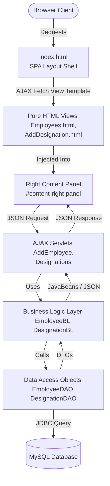

# HR-Nexus: Asynchronous SPA Architecture & Technical Analysis (stylethree)

This document provides a comprehensive technical analysis and architectural documentation of the **stylethree** project. It outlines the Single Page Application (SPA) design pattern, detailed project components, directory structure, and how it eliminates JavaServer Pages (JSP) in favor of pure HTML, CSS, client-side JavaScript, and JSON-based Servlets.

---

## 1. Project Basis & Technology Stack

The **stylethree** project is a modern **Single Page Application (SPA)** that manages employees and designations. It runs inside a Servlet Container (such as **Apache Tomcat 9**) but decouples the frontend presentation entirely from server-side JSP processing.

### Core Technology Stack:
*   **Backend Language**: Java SE 8+ (compiled inside `classes`)
*   **Web Framework/Specification**: Servlet 4.0 (for JSON API endpoints).
*   **JSON Processing**: Google Gson (for serialization/deserialization of payloads and API responses).
*   **Database Access**: JDBC with MySQL connector driver `mysql.jar`.
*   **Frontend**: Pure HTML5, Vanilla CSS3, and modern client-side JavaScript (AJAX/DOM manipulation). No JSP or server-side tag libraries are processed.

---

## 2. Architecture & Design Patterns: Single Page Application (SPA)

**stylethree** transitions the application from server-side JSP rendering (Model 2 MVC) to a modern **Asynchronous Single Page Application (SPA)** architecture. The browser requests `index.html` once, and subsequent interactions only swap the contents of a specific content panel dynamically.



### Key Components:

1.  **SPA Shell (`index.html`)**:
    *   Defines the persistent layout (Header, Left Navigation Menu, and Footer).
    *   Maintains a custom JavaScript routing engine.
    *   Authenticates session credentials on load and dynamically swaps content views inside `<div id='content-right-panel'>` using `XMLHttpRequest`.
    *   Includes a script compiler that extracts and safely executes component-specific scripts when injecting HTML templates.

2.  **Pure HTML View Templates**:
    *   Static, zero-JSP HTML files (e.g. `Designations.html`, `AddEmployee.html`).
    *   Contain only structural markup and local script tags to fetch backend JSON data and populate dynamic elements.

3.  **JSON Servlets**:
    *   Servlets under `com.ashvin.hr.nexus.servlets` receive incoming requests as JSON payloads.
    *   They utilize Google Gson to parse requests into JavaBeans, execute operations, and write responses as pure `application/json`.
    *   No presentation rendering happens on the server side.

---

## 3. Advanced Features in stylethree

### A. Decoupled JSON API Endpoints
All servlets process inputs and outputs exclusively as JSON. This separation allows the backend to act as a pure API server, facilitating potential hosting of the frontend on static CDNs.

### B. Client-Side Notifications
Success and error notifications utilize local storage (`localStorage`). When a write operation (Add/Edit/Delete) completes, the servlet responds with a JSON `MessageBean`. The JS saves this serialized message to `localStorage` and loads `Notification.html`. The notification view parses it and renders custom button options ("Yes"/"No") bound to SPA navigation.

---

## 4. Code Structure & Components

```
stylethree/
├── LoginPage.html             <- Pure HTML login screen
├── index.html                 <- Main SPA layout container & routing manager
├── Home.html                  <- Welcome dashboard view template
├── Designations.html          <- Table grid template for designations
├── AddDesignation.html        <- Designation addition form view template
├── EditDesignation.html       <- Designation update form view template
├── ConfirmDeleteDesignation.html <- Designation delete confirmation view template
├── Employees.html             <- Employees grid table view template
├── AddEmployee.html           <- Employee insertion form view template
├── EditEmployee.html          <- Employee modification form view template
├── ConfirmDeleteEmployee.html <- Employee delete confirmation view template
├── Notification.html          <- Message notification component view template
├── ErrorPage.html             <- Generic error page view template
├── css/                       <- Stylesheets (styles.css, employee.css, designation.css)
├── images/                    <- Graphical assets
├── js/                        <- Client-side script actions (Login.js, Designations.js, etc.)
└── WEB-INF/
    ├── web.xml                <- Deployment descriptor mapping JSON servlets
    └── classes/
        └── com/ashvin/hr/nexus/
            ├── beans/         <- JavaBeans (EmployeeBean, MessageBean, ErrorBean, etc.)
            ├── bl/            <- Business Logic layer mapping entities (EmployeeBL)
            ├── dl/            <- Data Access Layer (EmployeeDAO, DTOs, & DB Connector)
            └── servlets/      <- Pure JSON controller servlets
```
