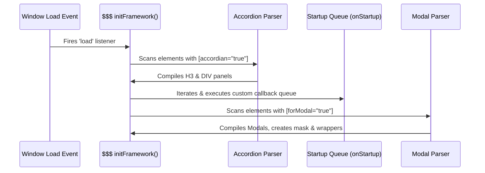

# TMJRock Frontend Framework Documentation

The **TMJRock Frontend Framework** is a lightweight, custom-built, client-side JavaScript utility library that acts as a mini-framework, providing selector operations, AJAX wrappers, form validation parameters, accordion UI components, modals, and dynamic data tables.

This documentation covers the architecture, library details, custom features, APIs, and direct behavioral comparisons with jQuery.

---

## 1. Architectural Overview & Bootstrapping Lifecycle

The TMJRock Frontend Framework uses a single namespace object (`$$$`) containing global registries, components, and startup states.

### State & Registries
The global `$$$` namespace organizes data in the following structures:
* **`$$$.model`**: The central repository for runtime tracking and system events:
  * **`onStartup`**: An array registry of callback functions to run once the workspace initializes.
  * **`accordians`**: List of initialized accordion layout instances, elements, and active pane indices.
  * **`modals`**: List of compiled Modal class instances ready to be opened.

### Bootstrapping Flow
The framework hooks into the browser window loading lifecycle to set up components automatically:



1. **Window Load Hook**: Triggered by `window.addEventListener("load", ...)`, calling `$$$.initFramework()`.
2. **Declarative Parsing of Accordions**: Scans all tags in the DOM searching for elements with `accordian="true"`. Each matching element is converted to an accordion instance via `$$$.toAccordian(t)`.
3. **Startup Queue Execution**: Iterates through and calls all functions registered in the `$$$.model.onStartup` array (populated via `$$$.onDocumentLoaded(func)`).
4. **Declarative Parsing of Modals**: Scans for `DIV` elements with the attribute `forModal="true"`. The framework converts them into Modal wrapper controls, registers them in `$$$.model.modals`, and cleans up their original DOM placement.

---

## 2. Core Selector Engine: TMJRock vs. jQuery

The selector implementation handles element retrieval and wraps target nodes in custom helper classes.

### API Signature & Comparison

| Feature | TMJRock Selector (`$$$`) | jQuery Selector (`$`) |
| :--- | :--- | :--- |
| **Input Format** | `$$$(cei)` — expects a unique Component Element ID (string). | `$()` — accepts standard CSS selectors (classes, tags, IDs, hierarchies). |
| **Output Type** | A single `TMJRockElement` instance, or `null` if element is not found. | A jQuery collection object containing zero or more matched elements. |
| **Chaining** | No chaining support. Methods return scalar values or modify state. | Supports method chaining by returning the jQuery collection object. |
| **Instantiation** | Calls `document.getElementById(cei)` under the hood. | Uses custom selector engines (Sizzle) or native query engines. |

### Selector Engine Implementation

```javascript
function $$$(cei) {
  let element = document.getElementById(cei);
  if (!element) return null;
  return new TMJRockElement(element);
}
```

### `TMJRockElement` Wrapper Methods

Elements returned by `$$$(cei)` are wrapped in the `TMJRockElement` constructor, exposing the following helper methods:

#### 1. `.html([content])`
Gets or sets the inner HTML content of the wrapped DOM element.
* **Arguments**: `content` (Optional string or number).
* **Behavior**: If `content` is passed, updates the element's `innerHTML`. Returns the current/updated `innerHTML`.
* **Example Usage**:
  * **TMJRock**: `$$$("dataAge").html(25);`
  * **jQuery**: `$("#dataAge").html(25);`

#### 2. `.value([content])`
Gets or sets the value attribute of input, textarea, or select fields.
* **Arguments**: `content` (Optional string).
* **Behavior**: If `content` is passed, updates the input's `value`. Returns the current/updated `value`.
* **Example Usage**:
  * **TMJRock**: `let name = $$$("firstName").value();`
  * **jQuery**: `let name = $("#firstName").val();`

#### 3. `.fillComboBox(jsonObject)`
A specialized utility method on `TMJRockElement` that populates dynamic options inside `<select>` dropdowns.
* **Arguments**: `jsonObject` configuration options:
  * `firstOption`: (Optional) Object with `{ text, value }` representing a default option (e.g., `< Select >`).
  * `dataSource`: (Required) Array of objects representing the data source list.
  * `text`: (Required) String name of the object key to use for display text.
  * `value`: (Required) String name of the object key to use for option values.
* **Validation & Exceptions**:
  * Throws an exception if called on any DOM tag other than `SELECT`.
  * Throws exceptions if any parameters, texts, values, or datasets are of incorrect type or missing.
* **Example Usage**:
  ```javascript
  $$$("designations").fillComboBox({
    "firstOption": { "text": "< Select >", "value": "-1" },
    "dataSource": designationsArray,
    "text": "title",
    "value": "code"
  });
  ```

---

## 3. AJAX Wrapper Engine

The `$$$.ajax` utility wraps raw browser asynchronous communications, providing standardized callback patterns.

### API Signature & Comparison

| Feature | TMJRock (`$$$.ajax`) | jQuery (`$.ajax`) |
| :--- | :--- | :--- |
| **Return Value** | `void` (strictly callback-oriented). | `jqXHR` (Promises/Deferred - `.done()`, `.fail()`). |
| **HTTP Methods** | Supports `GET` and `POST`. | Supports all standard methods (`GET`, `POST`, `PUT`, `DELETE`, etc.). |
| **GET Serialization** | Serializes `data` objects into query strings automatically. | Serializes URL parameters using `$.param()`. |
| **POST Serialization** | Toggled via `sendJSON` parameter to output JSON or URL-encoded payloads. | Automatically serializes or relies on `contentType` config. |
| **Response Parsing** | Automatically runs `JSON.parse` on responses. | Automatically parses content based on server's `Content-Type` header. |

### Technical Parameter Validations
To prevent silent runtime bugs, `$$$.ajax` immediately validates input parameters and throws descriptive exceptions:
* Throws `"missing argument in call to ajax"` if the config object is null or missing.
* Throws `"url property is missing in call to ajax"` if `url` is missing or not a string.
* Throws `"methodType is of string type..."` or `"methodType is from GET/POST..."` if the method type is specified but is invalid.
* Throws `"success is of function type..."` or `"failure is of function type..."` if these callbacks are provided but are not functions.

### Payload Encoding Specifications
For POST requests, the encoding type is determined by the `sendJSON` boolean property (defaults to `false`):

* **JSON Body Encoding (`sendJSON: true`)**:
  Appends `Content-Type: application/json` and sends a stringified JSON body:
  ```javascript
  xmlHttpRequest.setRequestHeader("Content-Type", "application/json");
  xmlHttpRequest.send(JSON.stringify(jsonData));
  ```
  *Use Case*: Sending nested structures or complex entity payloads to modern REST APIs.

* **URL Parameter Form Encoding (`sendJSON: false` or omitted)**:
  Appends `Content-Type: application/x-www-form-urlencoded` and compiles the parameters as query string key-values:
  ```javascript
  xmlHttpRequest.setRequestHeader("Content-Type", "application/x-www-form-urlencoded");
  xmlHttpRequest.send(queryString);
  ```
  *Use Case*: Standard form submits or legacy servlet compatibility.

---

## 4. UI Components

The TMJRock Frontend Framework utilizes a declarative markup design to auto-initialize complex components directly from HTML tags.

### A. Accordion UI Component
Accordions compile structured panels to save screen real estate. The accordion component activates on elements marked with `accordian="true"`.

#### HTML Syntax Pattern
```html
<div accordian="true">
  <h3>Accordion Panel 1</h3>
  <div>This is panel content 1...</div>
  <h3>Accordion Panel 2</h3>
  <div>This is panel content 2...</div>
</div>
```

#### Initialization & State Mechanics
1. **Node Filtering**: The framework iterates through the children of the accordion element, identifying `H3` headers and `DIV` panels.
2. **Layout Validation**: Throws a validation error `"Heading and division malformed to create accordian"` if headings and divisions are not in alternating pairs.
3. **Startup Collapsing**: Saves each panel's default display style configurations under an `oldDisplay` property, then sets their `display` properties to `"none"`.
4. **Event Handling**: Creates click callbacks using closures to track indices. When a heading is clicked, the active panel (if any) collapses (`display = "none"`), and the clicked heading's matching panel opens using its `oldDisplay` value.

#### TMJRock vs. jQuery UI Accordion
* **jQuery UI**: Requires manual invocation (e.g. `$("#acc").accordion();`). Relies heavily on custom CSS selectors and complex accessibility configurations.
* **TMJRock**: Declaratively initializes on document load by inspecting element properties. Offers lightweight, single-level CSS toggles.

---

### B. Modal UI Component
Modals overlay standard web pages to present isolated workspaces or forms. The TMJRock modal framework constructs mask divisions and coordinates element isolation.

#### Component Markup & Layout Configuration
Modals are declared by designating a container `DIV` with `forModal="true"`. The framework recognizes attributes to configure behavior:

```html
<div id="ModalA"
     forModal="true"
     style="display:none;"
     header="Settings Panel"
     footer="Save/Close Actions"
     size="600x400"
     maskColor="#123243"
     modalBackgroundColor="#543344"
     beforeOpening="beforeOpened()"
     afterOpening="onOpened()"
     beforeClosing="beforeClosed()"
     afterClosing="onClosed()">
  <!-- Modal body contents -->
</div>
```

#### Modal Attributes Specifications

| Attribute | Expected Format / Values | Description |
| :--- | :--- | :--- |
| **`size`** | `widthxheight` (e.g. `600x400`) | Width and Height dimensions. Sets container size. |
| **`header`** | Text string (HTML supported) | Header title bar inner HTML. |
| **`footer`** | Text string (HTML supported) | Footer container inner HTML. |
| **`maskColor`** | Hex/RGB color string | Background overlay mask color. |
| **`modalBackgroundColor`** | Hex/RGB color string | Container popup panel color. |
| **`closeButton`** | `"true"` or `"false"` (default: true) | If true, appends a closure button ("X") in the header bar. |
| **`beforeOpening`** | JS expression string | Callback executed before opening. If returns `false`, modal will not open. |
| **`afterOpening`** | JS expression string | Callback executed after opening transitions. |
| **`beforeClosing`** | JS expression string | Callback executed before closing. If returns `false`, modal will not close. |
| **`afterClosing`** | JS expression string | Callback executed after modal closes. |

#### Modal Instantiation Logic
1. **DOM Extraction**: The framework removes the original content element from its parents.
2. **Overlay Mask Creation**: Creates a background division element (`tmjrock_modalMask`) with absolute fixed coordinates covering the window viewport.
3. **Modal Frame Construction**: Creates a panel container (`tmjrock_modal`) and appends:
   * **Header Panel**: Contains title content and close button.
   * **Content Panel**: Houses the user-defined content element, setting height dynamically (`modalHeight - 110px`) with scroll settings enabled (`overflow: auto`).
   * **Footer Panel**: Positioned absolutely at the bottom boundary.
4. **Triggering Modals**: The modal is opened programmatically using `$$$.modals.show(contentId)`.

---

### C. Dynamic Data Table (Grid UI Component)
The `Grid` class delivers lightweight client-side table formatting, horizontal scroll synchronization, and page pagination controls.

#### Architecture of Scroll Synchronization
To keep tables responsive while displaying multi-column lists, grids are split into separate header and body components.
A scroll listener is attached to the body table wrapper (`.tmjrock_tmgrid_body_division`). As the body scrolls horizontally, the framework updates the scroll offset of the header wrapper (`.tmjrock_tmgrid_header_division`), ensuring column alignments match.

```javascript
var headerDivision = document.querySelector(".grid_header_division");
var bodyDivision = document.querySelector(".grid_body_division");

bodyDivision.addEventListener('scroll', function() {
  headerDivision.scrollLeft = bodyDivision.scrollLeft;
});
```

#### Client-Side Pagination & Render Loops
The `Grid` class handles paging rendering:
* **Current Page State**: Updates active row boundaries using `(pageNumber - 1) * pageSize`.
* **Row Repopulation**: Empties table DOM children (`deleteRow(0)`) and iterates over current slice elements, appending rows (`tr`) and cells (`td`).
* **Pagination Control Bar**: Dynamically builds navigation links (prev, next, and active index buttons).
* **Index Clamping**: Confirms page thresholds to restrict bounds of the pagination display range.

---

## 5. API Reference Summary

### Selector
```javascript
// Retrieve a wrapper instance
let inputEl = $$$("username");
```

### ComboBox Helper
```javascript
// Populate dropdown options
$$$("dropdownId").fillComboBox({
  firstOption: { text: "Select designation", value: "-1" },
  dataSource: responseArray,
  text: "keyForText",
  value: "keyForValue"
});
```

### AJAX Requests
```javascript
// Send requests
$$$.ajax({
  url: "servletEndpoint",
  methodType: "POST", // "GET" or "POST"
  data: { code: 101, title: "Manager" },
  sendJSON: true, // Use JSON string payload or form encoding
  success: function(response) {
    console.log("Success:", response);
  },
  failure: function() {
    console.error("Communication failure");
  }
});
```

### Document Startup Hooks
```javascript
// Register initialization logic
$$$.onDocumentLoaded(function() {
  console.log("TMJRock Framework Loaded");
});
```

### Modals Control
```javascript
// Open registered modal programmatically
$$$.modals.show("ModalA");
`---

## 6. Comprehensive TMJRock vs. jQuery Structural Comparison

The table below provides a detailed structural comparison between the design of both frameworks:

| Structural Area | TMJRock Frontend Framework | jQuery / jQuery UI |
| :--- | :--- | :--- |
| **DOM Selector Engine** | Strictly retrieves elements using native `document.getElementById()`. Has $O(1)$ lookup complexity. | Custom Sizzle selector engine (regex-based parsing) supporting CSS selectors. Has higher memory overhead. |
| **Wrapper Allocation** | Creates a new wrapper object `TMJRockElement` instance on every execution. | Re-wraps elements or collections, constructing array-like objects with helper prototypes. |
| **Null/Empty Handling** | Returns `null` if element is not found, causing errors if method calls are attempted. | Returns an empty jQuery collection wrapper object, ignoring chain calls. |
| **Event Dispatching** | Assigns direct callbacks on properties (e.g., `onclick = ...`) or uses native `addEventListener`. | Custom cross-browser event normalization, custom namespaces, and event delegation mechanisms. |
| **AJAX Architecture** | Thin wrapper over `XMLHttpRequest` utilizing callback-based models (`success`/`failure`). | High-complexity Deferred/Promise (`jqXHR`) utility with request interception and custom transport protocols. |
| **Payload Parsing** | Direct execution of `JSON.parse` on text body responses. | Content-type header inspection, custom data conversion rules, and script evaluation. |
| **Modal Structure** | Dynamically creates mask and popup frames and physically moves the target element into them. | Appends overlays and modal containers dynamically, applying CSS templates. |
| **Grid Implementation** | Custom client-side class supporting manual column layout scroll alignment and array-slice paging. | Full table management plugin (e.g., DataTables) supporting column sorting, search filters, and server-side paging. |

---

## 7. Detailed Flow of Feature Actions

To further detail the framework operations, the following sequences outline exactly how individual features execute under the hood:

### A. The ComboBox Population Action
When `.fillComboBox(jsonObject)` is invoked:
1. It verifies if the element's node name is `"SELECT"`. If not, it halts by throwing an exception.
2. It resets the SELECT element's properties: setting `selectedIndex = -1`, resetting value to `""`, and clearing inner HTML.
3. If `firstOption` config is provided, it validates `text` and `value` fields, builds a new `<option>` tag, and appends it to the selection list.
4. It iterates over the `dataSource` collection. For each item:
   - It retrieves display text and values based on mapping strings (`jsonObject.text` and `jsonObject.value`).
   - It builds an `<option>` DOM element and appends it to the `<select>` node.

### B. The AJAX Request Serialization Action
When `$$$.ajax(jsonObject)` is invoked:
1. It validates input parameters, throwing immediate errors on missing parameters or incorrect callback types.
2. It constructs a new native `XMLHttpRequest` instance and hooks to `onreadystatechange`.
3. If the request is `GET` and contains a `data` parameter:
   - It parses parameters and builds a URL query string (using `?` and `&`).
   - Appends query string to target URL.
   - Invokes `.open("GET", url)` and `.send()`.
4. If the request is `POST`:
   - Checks the `sendJSON` boolean.
   - If `sendJSON` is `true`, sets content type to `application/json` and sends a stringified payload body (`JSON.stringify(jsonData)`).
   - If `sendJSON` is `false` or omitted, sets content type to `application/x-www-form-urlencoded`, converts `data` parameters into a URL-encoded string, and transmits it as the request body.
5. On receiving state `4` status `200` response, the response text is parsed as a JSON object and passed directly to the registered `success` callback. Otherwise, calls `failure`.
