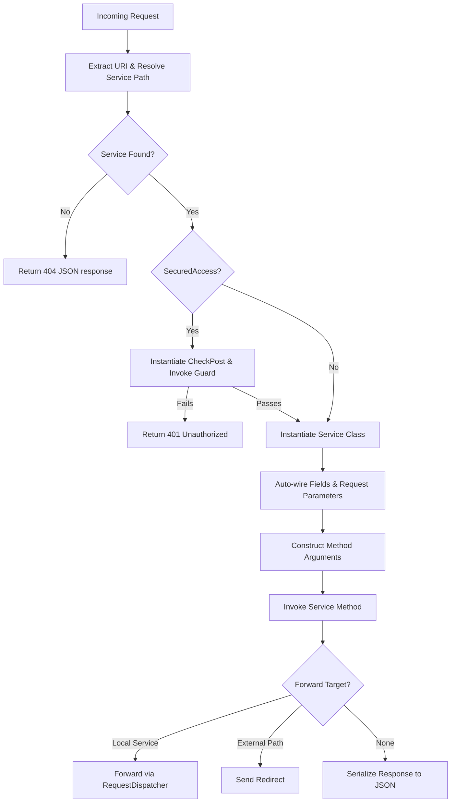

# WebRock Framework: Architecture & Technical Review

WebRock is a custom, lightweight Java-based web framework designed as a replica of Spring Boot's annotation-driven model. It operates on top of standard Java Servlet APIs (Servlet 4.0) and uses reflection to bootstrap services, auto-inject dependencies, enforce security, generate JavaScript client-side APIs, and produce PDF documentation.

---

## 1. Project Directory Structure

The codebase is organized into two primary namespaces:

```
webrock/
│
├── WEB-INF/
│   ├── web.xml                        # Servlet and package-prefix configurations
│   ├── classes/
│   │   ├── com/ashvin/web/rock/       # Framework Source (Amit - Developer)
│   │   │   ├── annotations/           # Custom annotations (@PATH, @POJO, etc.)
│   │   │   ├── exceptions/            # Framework exceptions (SecurityException, ServiceException)
│   │   │   ├── model/                 # Singleton registry (WebRockModel)
│   │   │   ├── pojo/                  # Metadata models (Service, SecurityAccess, scopes)
│   │   │   ├── utils/                 # Conversion & JSON utilities (WebRockUtils)
│   │   │   ├── WebRock.java           # Core Front Controller servlet
│   │   │   ├── WebRockStarter.java    # Bootstrap / scan servlet loaded on startup
│   │   │   └── JSFileLoading.java     # Servlet to serve generated JS client classes
│   │   │
│   │   └── bobby/                     # Framework User/Test Space (Bobby - Tester)
│   │       ├── student/               # Student DAO/DTO and DB Connection helpers
│   │       └── test/                  # Test scenarios (Injection, Security, Parameters)
│   │
│   ├── js/                            # Output folder for generated JS files
│   └── lib/                           # Compiled third-party dependencies (iText PDF, Gson)
│
├── Student.html                       # Frontend test dashboard
└── componentsStudent.html             # HTML UI templates
```

---

## 2. WebRock Annotation Reference

WebRock provides several custom annotations to mimic modern MVC frameworks:

| Annotation | Target | Description |
| :--- | :--- | :--- |
| `@PATH(value)` | Class, Method | Specifies the URI routing path. Class-level path acts as a prefix. |
| `@POJO(value)` | Class | Indicates a domain object/DTO. Generates a matching JS class representation. |
| `@GET` | Class, Method | Restricts HTTP method access to GET. Defaults to both GET and POST if none specified. |
| `@POST` | Class, Method | Restricts HTTP method access to POST. Defaults to both GET and POST if none specified. |
| `@AutoWired(name)` | Field | Injects dependencies from request, session, or servlet context attributes by name. |
| `@InjectRequestParameter(value)` | Field | Injects a request query or form parameter into a class field with type conversion. |
| `@RequestParameter(name)` | Parameter | Binds a method parameter to a request parameter or request body (if unnamed JSON). |
| `@SecuredAccess(checkPost, guard)`| Class, Method | Declares a security interceptor class (`checkPost`) and its guard method. |
| `@FORWARD(value)` | Method | Forwards the request to another route on success, or redirects if not a local service. |
| `@OnStartup(priority)` | Method | Registers a service method to run at servlet startup, ordered by priority. |
| `@InjectApplicationScope` | Class | Enables automatic injection of `ApplicationScope` via `setApplicationScope()`. |
| `@InjectSessionScope` | Class | Enables automatic injection of `SessionScope` via `setSessionScope()`. |
| `@InjectRequestScope` | Class | Enables automatic injection of `RequestScope` via `setRequestScope()`. |
| `@InjectApplicationDirectory` | Class | Enables automatic injection of `ApplicationDirectory` via `setApplicationDirectory()`. |

---

## 3. Core Engine Lifecycles

### A. Bootstrap Lifecycle (`WebRockStarter.java`)

When the servlet container (e.g., Apache Tomcat) initializes:
1. **Configuration Scanning**:
   Reads `SERVICE_PACKAGE_PREFIX` (e.g., `bobby`) and `JS_FILE_NAME` from servlet configuration.
2. **Package Traversal**:
   Recursively walks the classes folder under the prefix to find `.class` files.
3. **Metadata Analysis**:
   Uses Java reflection to parse class annotations:
   - For classes marked with `@POJO`: Generates a JavaScript model class with appropriate constructor, getters, and setters.
   - For classes marked with `@PATH`:
     - Identifies fields with `@AutoWired` and `@InjectRequestParameter`.
     - Identifies methods with `@PATH`, `@GET`, `@POST`, `@SecuredAccess`, `@FORWARD`, and `@OnStartup`.
     - Builds JS methods wrapping HTTP request calls (`XMLHttpRequest`) returning ES6 `Promises`.
4. **JS Compilation**:
   Outputs the generated JS models to `/WEB-INF/js/` under separate file names or a single configured filename.
5. **Cross-Referencing Security**:
   Resolves the target routes for all security guards defined in `@SecuredAccess`.
6. **PDF Documentation Generation**:
   Generates a print-ready documentation PDF (`[SITE_NAME]DOC.pdf`) under the website root utilizing the **iText** library.
7. **Startup Execution**:
   Collects all methods marked with `@OnStartup`, sorts them by ascending `priority`, and executes them.

---

## 4. Request Lifecycle & Routing Engine (`WebRock.java`)

Every request mapped to `WebRock` (e.g., matching servlet mappings like `/studentService/*`) flows through the core handler:



### Dependency Injection & Scope Mapping

WebRock wraps servlet scopes to decouple services from low-level servlet objects:

* **`ApplicationScope`**: Wraps `ServletContext` attributes (`setAttribute`, `getAttribute`).
* **`SessionScope`**: Wraps `HttpSession` attributes (`setAttribute`, `getAttribute`).
* **`RequestScope`**: Wraps `HttpServletRequest` attributes (`setAttribute`, `getAttribute`).
* **`ApplicationDirectory`**: Wraps the physical application base folder path as a `File` object.

Wired fields are resolved in hierarchical order: **Request scope** $\rightarrow$ **Session scope** $\rightarrow$ **Application scope**.

---

## 5. Client Generation Mechanics

WebRock generates JavaScript APIs that match the signature of your Java classes:

* **POJO Generation**: Translates Java instance variables into JavaScript properties, constructor arguments, and camelCase getters/setters.
* **Service Client Generation**:
  - Class-level `@PATH` and method-level `@PATH` are joined to create the AJAX request URL.
  - Method parameters are mapped to request options. If a parameter has no name and matches a custom object type, it is serialized as a JSON string and sent in the request body via a `POST` request.
  - If parameters are named using `@RequestParameter`, they are sent as URL query parameters via a `GET` request.
  - Returns a standard ES6 `Promise` which resolves to the parsed JSON response or rejects with status errors.

---

## 6. Auto-Documentation Mechanics

During startup, WebRock creates a tabular PDF report using `iText` containing:
1. **Routing Metrics**: Paths, classes, methods, and allowed HTTP verbs.
2. **Parameters & Inputs**: Detailed signatures highlighting whether arguments are loaded from JSON requests, auto-filled context scopes, or query strings.
3. **Security Details**: Interceptor classes and guard methods enforcing route constraints.
4. **Exception Handling**: List of exceptions thrown by each endpoint.
