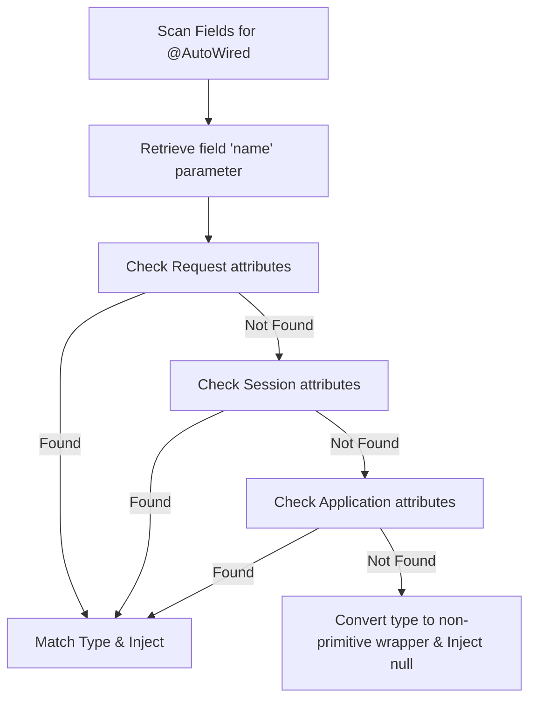
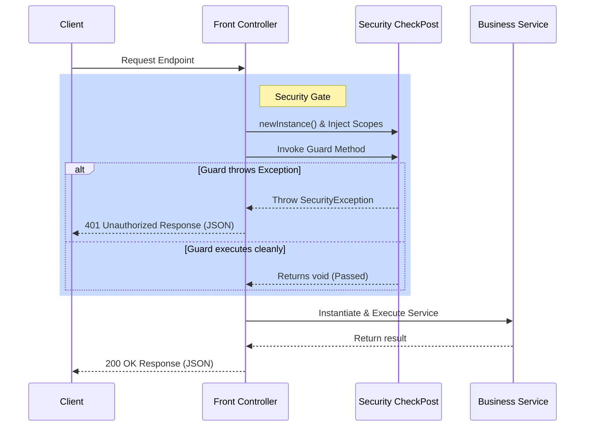

# WebRock Web Framework Documentation

Welcome to the official developer and user documentation for the **WebRock Framework**—a custom-built, lightweight replica of the Spring Boot framework running on standard Java Servlet containers.

---

## Section 1: Introduction & Architectural Overview

Traditional J2EE web development requires writing multiple servlet classes and explicitly mapping their URL paths in a `web.xml` deployment descriptor. As an application grows, this approach leads to a large volume of boilerplate code and configuration files.

**WebRock** addresses this issue by introducing a reflection-driven model. By using custom Java annotations, developers can turn plain old Java objects (POJOs) into active controllers, services, and DTOs.

---

### Core Architectural Patterns

WebRock operates on three fundamental patterns:

1. **Front Controller Pattern (`WebRock.java`)**
   Rather than mapping separate servlets to individual endpoints, WebRock registers a single routing servlet (`WebRock`) to catch wildcard patterns (e.g., `/studentService/*`, `/requestParameterTesting/*`). This servlet acts as the centralized gateway (Front Controller), dynamically resolving path routes, verifying security, injecting dependencies, and invoking service endpoints via reflection.

2. **Bootstrapping & Classpath Scanning (`WebRockStarter.java`)**
   On application startup, WebRock searches the classpath for packages matching a configured prefix. It discovers annotated classes, registers endpoint metadata, runs prioritized startup tasks, compiles ES6 JavaScript clients for client-side use, and generates a PDF directory listing of the API.

3. **Decoupled Context Scopes**
   To avoid direct dependencies on servlet APIs (`HttpServletRequest`, `HttpSession`, `ServletContext`), WebRock wraps these resources in custom class scopes (`RequestScope`, `SessionScope`, `ApplicationScope`, `ApplicationDirectory`). These scope wrappers can then be automatically wired or injected into your services.

---

### The Startup & Request Lifecycle

#### 1. The Startup Lifecycle (Bootstrap)
When the servlet container (e.g., Apache Tomcat) initializes:
1. **Load-on-Startup**: The container reads `web.xml` and initializes `WebRockStarter`.
2. **Package Scan**: The starter locates classes matching `SERVICE_PACKAGE_PREFIX` (e.g., `bobby`).
3. **Registration**: Services and DTOs are scanned. Endpoint definitions are saved in the singleton registry (`WebRockModel`).
4. **JS Generation**: JS client code is generated dynamically and stored in `/WEB-INF/js/`.
5. **Auto-Documenting**: A PDF file listing all endpoints (`webrockDOC.pdf`) is written to the root folder using `iText`.
6. **Task Run**: Methods annotated with `@OnStartup` are executed in order of ascending priority.

#### 2. The Request Lifecycle (Runtime)
When a client triggers an AJAX request or form submission:
1. **Routing**: `WebRock` servlet intercepts the request, cleanses the site name prefix, and queries `WebRockModel` for a matching `Service`.
2. **Security Interception**: If `@SecuredAccess` is declared, the designated security checkpost and guard methods are executed.
3. **Dependency Injection**: `@AutoWired` fields and request parameter injections are resolved.
4. **Argument Resolution**: Method arguments are populated (either by reading the request payload JSON or binding query strings).
5. **Execution**: The service method is executed.
6. **Response Handling**: The output is serialized to JSON or forwarded to another route if `@FORWARD` is present.

---

### Project Package Layout

```
com.ashvin.web.rock (Amit - Framework Developer)
 ├── annotations/          # Routing, injection, security, and startup annotations
 ├── exceptions/           # Core framework runtime exceptions
 ├── model/                # Singleton WebRockModel route repository
 ├── pojo/                 # Configuration, mapping, and scope POJOs
 ├── utils/                # Gson serializers and primitive wrappers
 ├── WebRock.java          # Front Controller dispatcher servlet
 ├── WebRockStarter.java   # Startup loader & compiler servlet
 └── JSFileLoading.java    # Generated JavaScript provider servlet

bobby (Bobby - Framework User & Tester)
 ├── student/              # Database schema, DTOs, and DAO implementations
 └── test/                 # Test cases validating injection, routing, and guards
```

---

## Section 2: Detailed Annotation Directory

WebRock leverages annotations to configure components, control routing, enable scoping, and perform auto-wiring. Below is an exhaustive directory of all custom annotations provided by the framework.

---

### 1. `@PATH`
* **Target**: `ElementType.TYPE` (Class), `ElementType.METHOD`
* **Parameters**:
  - `value` (String, default `""`): The URI path segment.
* **Usage**:
  Defines the route mappings for classes and methods. Class-level paths act as prefixes, and method-level paths define the final relative endpoint.
* **Example**:
  ```java
  @PATH("/studentService")
  public class StudentManager {
      @PATH("/add")
      public void addStudent(Student student) { ... }
  }
  // Maps to: /studentService/add
  ```

---

### 2. `@POJO`
* **Target**: `ElementType.TYPE` (Class)
* **Parameters**:
  - `value` (String, default `""`): Custom JS file name (optional).
* **Usage**:
  Marks DTOs, beans, or model classes. When scanned on startup, a matching JavaScript class is automatically compiled with a constructor, getters, and setters.
* **Example**:
  ```java
  @POJO
  public class StudentDTO implements Serializable {
      private int rollNumber;
      private String name;
      // Constructor, getters, and setters will be generated in StudentDTO.js
  }
  ```

---

### 3. `@GET` & `@POST`
* **Target**: `ElementType.TYPE` (Class), `ElementType.METHOD`
* **Parameters**: None
* **Usage**:
  Restricts HTTP access methods. If neither is specified, the framework defaults to enabling both GET and POST requests.
* **Example**:
  ```java
  @PATH("/studentService")
  public class StudentManager {
      @GET
      @PATH("/getAll")
      public List<Student> getStudents() { ... }
  }
  ```

---

### 4. `@AutoWired`
* **Target**: `ElementType.FIELD`
* **Parameters**:
  - `name` (String, default `""`): The identifier name of the attribute in context scopes.
* **Usage**:
  Automatically injects variables into class fields. When instantiating the service class, WebRock checks the scopes (Request, Session, and Application, in order) for an attribute matching `name`.
* **Example**:
  ```java
  @PATH("/studentService")
  public class StudentManager {
      @AutoWired(name = "dbConnection")
      private Connection connection;

      public void setConnection(Connection connection) {
          this.connection = connection;
      }
  }
  ```

---

### 5. `@InjectRequestParameter`
* **Target**: `ElementType.FIELD`
* **Parameters**:
  - `value` (String, default `""`): The HTTP request query string or form parameter key.
* **Usage**:
  Injects query or form parameters directly into a class-level field. The framework automatically parses the values into basic primitive or wrapper types.
* **Example**:
  ```java
  @PATH("/requestTesting")
  public class TestService {
      @InjectRequestParameter("page")
      private int pageNumber;

      public void setPageNumber(int pageNumber) {
          this.pageNumber = pageNumber;
      }
  }
  ```

---

### 6. `@RequestParameter`
* **Target**: `ElementType.PARAMETER` (Method Argument)
* **Parameters**:
  - `name` (String, default `""`): The parameter query string name.
* **Usage**:
  Binds a method argument to an HTTP query parameter. If `name` is omitted (blank), the framework maps the argument to the raw request payload (usually a JSON body) and deserializes it using Gson.
* **Example**:
  ```java
  @PATH("/search")
  public List<Student> search(
      @RequestParameter("name") String studentName, // Mapped from ?name=xyz
      @RequestParameter("limit") int limit          // Mapped from &limit=10
  ) { ... }
  ```

---

### 7. `@SecuredAccess`
* **Target**: `ElementType.TYPE` (Class), `ElementType.METHOD`
* **Parameters**:
  - `checkPost` (String, default `""`): Absolute class path of the security provider.
  - `guard` (String, default `""`): Name of the method enforcing check conditions.
* **Usage**:
  Implements endpoint authorization. Before running the target route, WebRock executes the designated checkpost guard. If the guard throws a `SecurityException`, access is denied (401 Unauthorized).
* **Example**:
  ```java
  @PATH("/studentService")
  public class StudentManager {
      @SecuredAccess(checkPost = "bobby.test.Authenticate", guard = "login")
      @PATH("/add")
      public void addStudent(Student student) { ... }
  }
  ```

---

### 8. `@FORWARD`
* **Target**: `ElementType.METHOD`
* **Parameters**:
  - `value` (String, default `""`): The target service path or external URL redirect.
* **Usage**:
  Routes the browser or forwards the servlet request context to the specified location upon successful method completion.
* **Example**:
  ```java
  @PATH("/studentService")
  public class StudentManager {
      @PATH("/add")
      @POST
      @FORWARD("/webrock/index.html")
      public void addStudent(Student student) { ... }
  }
  ```

---

### 9. `@OnStartup`
* **Target**: `ElementType.METHOD`
* **Parameters**:
  - `priority` (int, default `0`): Ascending execution order priority.
* **Usage**:
  Indicates that the method must run when the web server initializes. Values must be $\ge 0$. Methods are sorted and loaded accordingly.
* **Example**:
  ```java
  public class DatabaseInitializer {
      @OnStartup(priority = 1)
      @PATH("/initDB")
      public void initializeDatabase() {
          System.out.println("Database tables checked/created.");
      }
  }
  ```

---

### 10. Scope Injection Annotations (`@InjectRequestScope`, etc.)
* **Target**: `ElementType.TYPE` (Class)
* **Annotations**: `@InjectRequestScope`, `@InjectSessionScope`, `@InjectApplicationScope`, `@InjectApplicationDirectory`
* **Usage**:
  Directs WebRock to inject wrapper classes of standard Servlet contexts (`RequestScope`, `SessionScope`, `ApplicationScope`, or `ApplicationDirectory` wrapper) through setter methods (e.g. `setRequestScope(RequestScope rs)`).
* **Example**:
  ```java
  @InjectSessionScope
  @PATH("/checkout")
  public class CheckoutService {
      private SessionScope sessionScope;

      public void setSessionScope(SessionScope sessionScope) {
          this.sessionScope = sessionScope;
      }
  }
  ```

---

## Section 3: Scopes, Injection & Context Engine

In typical J2EE web applications, business logic is often tightly coupled with servlet APIs like `HttpServletRequest`, `HttpSession`, and `ServletContext`. WebRock decouples these using **Context Scope Wrappers** and a reflection-based **Injection Engine**.

---

### 1. Scope Wrapper Classes

WebRock wraps servlet scopes in simple helper classes located in `com.ashvin.web.rock.pojo`. These classes allow endpoints to read and write attributes without importing servlet APIs directly.

#### A. `RequestScope`
Wraps the raw `HttpServletRequest` object for the current thread request.
* **Key Methods**:
  - `setAttribute(String key, Object value)`: Binds an object to the request.
  - `getAttribute(String key)`: Retrieves an object from the request.

#### B. `SessionScope`
Wraps `HttpSession` to maintain client state across multiple requests.
* **Key Methods**:
  - `setAttribute(String key, Object value)`: Stores an object in the session.
  - `getAttribute(String key)`: Retrieves an object from the session.
  - `removeAttribute(String key)`: Invalidates a specific session attribute.

#### C. `ApplicationScope`
Wraps `ServletContext` to store global data shared across all users and connections.
* **Key Methods**:
  - `setAttribute(String key, Object value)`: Stores an object globally.
  - `getAttribute(String key)`: Retrieves an object globally.
  - `removeAttribute(String key)`: Invalidates a specific application attribute.

#### D. `ApplicationDirectory`
Provides service methods with access to the physical deployment directory of the web application.
* **Key Methods**:
  - `getDirectory()`: Returns a `java.io.File` object pointing to the root real-path of the application (e.g., `getServletContext().getRealPath("/")`).

---

### 2. Auto-Wiring Injection Mechanics (`@AutoWired`)

When a client triggers a mapped service URL, the front controller (`WebRock.java`) instantiates the target service class and performs field-level auto-wiring:



#### The Lookup Hierarchy:
1. **Request Attributes**: Checked first via `request.getAttribute(name)`.
2. **Session Attributes**: Checked second via `request.getSession().getAttribute(name)`.
3. **Application Attributes**: Checked last via `request.getServletContext().getAttribute(name)`.

#### Type Matching & Wrapper Conversion:
- Before injecting, the engine wraps primitive field types (e.g. `int` is wrapped to `Integer.class`) using `WebRockUtils.wrap()`.
- It performs a type safety check: `parameterTypeNP.isInstance(nameResult)`.
- If the attribute exists but is of an incompatible type, WebRock throws a `ServiceException` preventing runtime class cast errors:
  `Invalid arguments of type X passed to method [setY] against @AutoWired annotation, Required Z`
- If no attribute is found in any scope, the engine sets the field to a safe default (e.g., `0` for primitives or `null` for objects) via calling `WebRockUtils.parseTo(parameterTypeNP, null)`.

---

### 3. Scope Injection via Class Setters

In addition to field wiring, classes can request full access to scope wrappers via class-level annotations.

- `@InjectApplicationScope` $\rightarrow$ triggers `setApplicationScope(ApplicationScope)`
- `@InjectSessionScope` $\rightarrow$ triggers `setSessionScope(SessionScope)`
- `@InjectRequestScope` $\rightarrow$ triggers `setRequestScope(RequestScope)`
- `@InjectApplicationDirectory` $\rightarrow$ triggers `setApplicationDirectory(ApplicationDirectory)`

#### Execution Flow:
1. WebRock checks the service class for these class-level annotations.
2. If present, it uses reflection to locate the matching setter method (e.g., `setSessionScope`).
3. It instantiates/wraps the required scope object (e.g., `new SessionScope()`) and invokes the setter method using reflection.

---

### 4. Parameter Parsing Utility (`WebRockUtils.parseTo`)

WebRock includes a robust type-conversion engine to parse HTTP string inputs (query strings, form parameters) into Java types:

* **Primitives & Wrappers supported**: `long/Long`, `int/Integer`, `short/Short`, `byte/Byte`, `double/Double`, `float/Float`, `boolean/Boolean`, `char/Character`, and `String`.
* **Fallback Defaults**:
  If a number format error is encountered (e.g., trying to parse `"abc"` as an integer), the parsing utility catches `NumberFormatException` and returns standard defaults:
  - Numeric types: `0` or `0.0`
  - Booleans: `false`
  - Characters: `' '` (space character)
  - String: Original input string
* **JSON Mapping**: If `convertFrom` is set to `"JSON"`, the utility invokes the Google Gson library `gson.fromJson(parameterValue, parameterType)` to deserialize complex structures.

---


## Section 4: Routing Engine & Request Lifecycle

This section describes how the WebRock front controller resolves incoming URLs, binds method arguments to client payloads, forwards contexts, and handles exceptions.

---

### 1. Front Controller Route Resolution

Every incoming request maps to the standard servlet lifecycle method `doGet` or `doPost` in `WebRock.java`, which delegates to the internal dispatcher: `doIt(HttpServletRequest request, HttpServletResponse response, String type)`.

#### Path Resolution Steps:
1. **Retrieve Configurations**: The engine reads the `SITE_NAME` deployment parameter (configured in `web.xml`).
2. **Cleanse URI**: It extracts the relative route path by dropping the context path and site name:
   $$\text{fullPathToService} = \text{requestURI} - \text{siteName}$$
   *Example*: If URL is `/webrock/studentService/add` and siteName is `webrock`, the resolved endpoint path is `/studentService/add`.
3. **Query Services Registry**: It requests the mapped endpoint metadata from the `WebRockModel` singleton:
   `Service service = webRockModel.getPathService(fullPathToService, type);`
4. **404 Handling**: If the endpoint or the HTTP request verb (type) is not registered, the controller responds with a `404 Not Found` JSON body:
   `{"error": "Requested service not found."}`

---

### 2. Method Argument Binding Rules

Once a routing match is found, WebRock analyzes the method signature of the endpoint. Arguments are parsed and populated dynamically based on their configuration:

#### A. Scope Auto-filling
If a method parameter class type matches any of the scope wrapper classes (`ApplicationScope`, `SessionScope`, `RequestScope`, or `ApplicationDirectory`), WebRock instantiates the wrapper for the current request context and passes it automatically.

#### B. Request Parameter Mapping (`@RequestParameter("name")`)
If the parameter is marked with a name attribute, WebRock extracts the value using `request.getParameter(name)`. It then converts the string value to the method parameter type via `WebRockUtils.parseTo`.

#### C. JSON Request Payload Binding (Unnamed Objects)
If a parameter does not have a `@RequestParameter` name, it is treated as a complex object representation. WebRock assumes the client has sent a raw JSON payload in the request body.
- The engine reads the body using `request.getReader()`.
- It converts the JSON string to the target parameter object using Gson:
  `WebRockUtils.parseTo(parameterType, parameterValue, "JSON")`

> [!IMPORTANT]
> **Payload Mapping Constraints**:
> 1. You may have at most **one** unnamed object parameter representing the JSON body payload.
> 2. Mixing query string arguments (using `@RequestParameter` with a name) and a JSON body payload in the same method signature is **strictly prohibited**. Doing so will cause the framework to throw a `ServiceException`:
>    *`Cannot use @RequestParameter alongwith JSON data in request to process multiple parameter on service...`*

---

### 3. Route Forwarding & Redirects (`@FORWARD`)

Endpoints can route requests upon successful execution by declaring a `@FORWARD` annotation on the method.

- **Internal Forwarding**: WebRock checks if the target forward string matches another route inside `WebRockModel`. If matched, the request is forwarded internally via the servlet dispatcher:
  `getServletContext().getRequestDispatcher(forwardToPath).forward(request, response);`
- **External Redirecting**: If the path does not map to a registered WebRock service, the engine performs a standard HTTP redirect:
  `response.sendRedirect(forwardToPath);`

---

### 4. Exception Mapping & Responses

WebRock captures service exceptions thrown during reflection:

1. **Root Cause Extraction**: It intercepts reflection execution errors (`InvocationTargetException`), extracts the root cause via `.getCause()`, and matches it against the list of exceptions declared in the service method signature (`method.getExceptionTypes()`).
2. **Declared Exceptions**: If the thrown exception matches a declared signature exception (e.g. `DAOException`), WebRock extracts the exception message and responds to the client with a formatted JSON payload and a `500` HTTP status:
   `{"error": "exception_message"}`
3. **Implicit WebRock Security Failures**: Catching a `com.ashvin.web.rock.exceptions.SecurityException` forces a `401 Unauthorized` status returning:
   `{"error": "Unauthorized access."}`
4. **General Unhandled Runtime Failures**: Any other generic exceptions or system crashes return a standard internal server response with a `500` status:
   `{"error": "Internal server error"}`

---

### 5. Custom Framework Exceptions

WebRock defines two specialized classes inside `com.ashvin.web.rock.exceptions` to distinguish framework setup issues from client access issues:

* **`SecurityException`** (extends `java.lang.SecurityException`):
  An unchecked runtime exception thrown by security guard checkers when authorization fails. WebRock automatically catches this exception at runtime and returns an HTTP `401 Unauthorized` response.
* **`ServiceException`** (extends `java.lang.Exception`):
  A checked exception used to report initialization conflicts, wiring mismatches (e.g., auto-wiring type incompatibilities), or illegal request mapping signatures (such as combining query parameters with JSON body payloads). Thrown during runtime dispatch or bootstrap mapping checks to trigger a `405 Method Not Allowed` or `500 Internal Server Error` response.

---

## Section 5: Security Guard Model

WebRock provides route-level authorization mapping via the `@SecuredAccess` annotation. It intercepts endpoints, validates request attributes, and isolates security verification from controller business logic.

---

### 1. The `@SecuredAccess` Interception Pattern

The `@SecuredAccess` annotation can be placed at the **class level** (protecting all endpoints in that class) or the **method level** (protecting a specific method).

- If both are present, the **method-level** `@SecuredAccess` overrides class-level policies.
- The annotation takes two arguments:
  - `checkPost`: The fully qualified Java class name of the security checker class.
  - `guard`: The name of the method within the checker class that executes verification logic.

---

### 2. Startup Verification & Path Binding

During bootstrapping (`WebRockStarter.java`), the framework validates all security declarations:

1. **Class Verification**: WebRock searches for the checkpost class name using `Class.forName(checkPost)`.
2. **Method Search**: It matches the guard method name.
3. **Signature Rules Validation**:
   - The guard method parameters can **only** accept scope wrapper classes (`ApplicationScope`, `SessionScope`, `RequestScope`, or `ApplicationDirectory`). If any other parameter types are present, the verification fails and the guard is flagged as invalid.
   - The guard method **must return `void`**. If the guard returns any value, it is considered invalid and throws a `SecurityException` during execution.
4. **Service Binding**: WebRock matches the guard method to a registered path endpoint inside the registry and maps the reference within the `Service` metadata object:
   `securityAccess.setServicePath(service2.getPath());`

---

### 3. Runtime Security Execution Path

When a request triggers a secured service, WebRock executes the guard filter *before* routing to the target method:



1. **Instantiation**: WebRock creates an instance of the checkpost class:
   `Object checker = securityServiceClass.newInstance();`
2. **Dependency Injection**: It parses the checkpost class for `@AutoWired` fields and injects scope variables from Request, Session, or ServletContext attributes.
3. **Guard Invocation**: It compiles the arguments (the required scope wrappers) and invokes the guard method:
   `securityServiceMethod.invoke(checker, parametersValue);`
4. **Evaluation**:
   - If the guard method completes without throwing an exception, authorization succeeds, and WebRock proceeds to execute the target service.
   - If the guard throws a declared exception (e.g. `new SecurityException("Invalid username")`), WebRock catches it, sets the HTTP response status to `401 Unauthorized`, and returns the message:
     `{"error": "Unauthorized access."}`

---

## Section 6: Auto-Generated JavaScript Client

A key feature of WebRock is its code generation compiler. On startup, WebRock compiles Java classes into frontend JavaScript APIs, eliminating the need to write manual AJAX/fetch calls or matching client-side DTO properties.

---

### 1. Compilation Configuration & Storage

- **File Output Directory**: Generated `.js` files are saved in `/WEB-INF/js/`.
- **Single File Compilation**:
  If the `JS_FILE_NAME` context parameter is configured in `web.xml`, WebRock compiles **all** DTO models and API clients into a single file under that name (e.g. `pojo_service.js`).
- **Individual File Compilation**:
  If `JS_FILE_NAME` is omitted, the framework creates individual files:
  - For DTOs: `[POJOValue].js` (or matches class name `[DTOClass].js` by default).
  - For Services: `[basePathName].js` (e.g., `@PATH("/StudentManager")` outputs to `StudentManager.js`).

---

### 2. DTO Code Compilation (`@POJO`)

For every Java class annotated with `@POJO`, WebRock parses class fields and creates a matching ES6 class structure:

1. **Constructor Properties**: The class constructor parameters map to the exact fields of the Java class.
2. **Encapsulation Accessors**: CamelCase getters and setters are compiled for all properties.

#### Code Comparison:
* **Java DTO (`StudentDTO.java`)**:
  ```java
  @POJO
  public class StudentDTO {
      private int rollNumber;
      private String name;
      // Getters & Setters...
  }
  ```
* **Compiled JS (`StudentDTO.js`)**:
  ```javascript
  class StudentDTO {
      constructor(rollNumber, name) {
          this.rollNumber = rollNumber;
          this.name = name;
      }
      setRollNumber(rollNumber) {
          this.rollNumber = rollNumber;
      }
      getRollNumber() {
          return this.rollNumber;
      }
      setName(name) {
          this.name = name;
      }
      getName() {
          return this.name;
      }
  }
  ```

---

### 3. API Client Compilation (`@PATH`)

For every Java class annotated with `@PATH`, WebRock generates a JS API wrapper containing client endpoints that map to Java methods:

1. **Class Mapping**: The JS class shares the Java class name (e.g. `class StudentDAO`).
2. **Method Filtering**:
   - Only methods marked with `@PATH` are generated.
   - Arguments that match scope wrapper classes (`SessionScope`, etc.) are stripped, as they are populated implicitly on the server.
3. **Payload Formatting**:
   - **Query Parameters**: If arguments use `@RequestParameter` (such as primitive fields), the client uses ES6 `URLSearchParams` to format a query string appended to the URL:
     ```javascript
     const queryString = new URLSearchParams({ rollNumber }).toString();
     finalUrl += `?${queryString}`;
     ```
   - **JSON Body Payload**: If an argument has no name, it is treated as the JSON payload. The client converts the object to a JSON string and maps the HTTP method to `POST`:
     ```javascript
     const body = JSON.stringify(studentDTO);
     xhr.send(body);
     ```
4. **ES6 Promise Wrapper**:
   All compiled client methods return a standard JavaScript `Promise`:
   - **Resolve (200 range status)**: Resolves the parsed JSON object:
     `resolve(JSON.parse(xhr.responseText))`
   - **Reject (Non-200 status)**: Rejects with status codes and the error message parsed from the response JSON:
     `reject({ status: xhr.status, message: JSON.parse(xhr.responseText).error })`
   - **Reject (Network Failure)**: Returns a general network exception if request fails to dispatch:
     `reject(new Error('Network Error'))`

#### Compiled Service Client Example (`StudentManager.js`):
```javascript
class StudentDAO {
    constructor() {}

    // POST request with JSON body payload mapping
    add(studentDTO) {
        return new Promise((resolve, reject) => {
            const xhr = new XMLHttpRequest();
            let finalUrl = 'StudentManager/add';
            xhr.open("POST", finalUrl);
            xhr.setRequestHeader('Content-Type', 'application/json');
            xhr.onload = () => {
                if (xhr.status >= 200 && xhr.status < 300) {
                    resolve(JSON.parse(xhr.responseText));
                } else {
                    reject({ status: xhr.status, message: JSON.parse(xhr.responseText).error });
                }
            };
            xhr.onerror = () => reject(new Error('Network Error'));
            const body = JSON.stringify(studentDTO);
            xhr.send(body);
        });
    }

    // GET request with query-string parameters mapping
    delete(rollNumber) {
        return new Promise((resolve, reject) => {
            const xhr = new XMLHttpRequest();
            let finalUrl = 'StudentManager/delete';
            const queryString = new URLSearchParams({ rollNumber }).toString();
            finalUrl += `?${queryString}`;
            xhr.open("GET", finalUrl);
            xhr.setRequestHeader('Content-Type', 'application/json');
            xhr.onload = () => {
                if (xhr.status >= 200 && xhr.status < 300) {
                    resolve(JSON.parse(xhr.responseText));
                } else {
                    reject({ status: xhr.status, message: JSON.parse(xhr.responseText).error });
                }
            };
            xhr.onerror = () => reject(new Error('Network Error'));
            xhr.send();
        });
    }
}
```

---

## Section 7: Bootstrap & Auto-Doc Engine

WebRock handles application context bootstrapping dynamically. During initialization, it scans packages, launches priority background services, compiles client scripts, and exports an API reference catalog in PDF format.

---

### 1. Classpath Scanner & Package Traversal

When the servlet container boots `WebRockStarter`, the loader performs classpath analysis:

1. **Parameter Retrieval**: It reads `SERVICE_PACKAGE_PREFIX` (which defines the user package, e.g. `bobby`).
2. **Absolute Path Resolution**: The loader maps the package to its absolute system path:
   `String pathToClassFolder = getServletContext().getRealPath("/WEB-INF/classes");`
3. **Recursive Directory Walk**: Using Java NIO `Files.walk(rootPath)`, the scanner traverses the directory tree and gathers all file paths ending in `.class`.
4. **FQN Resolution**: It converts the relative file paths into Fully Qualified Java Class Names:
   ```java
   // Converts "/WEB-INF/classes/bobby/test/Student.class" to "bobby.test.Student"
   String relativePath = Paths.get(rootDir).relativize(classPath).toString();
   String className = relativePath.replace(File.separator, ".").replace(".class", "");
   ```
5. **Class Loading**: Loads the class using reflection: `Class.forName(className)`.

---

### 2. Prioritized Startup Tasks (`@OnStartup`)

**Services** can register background tasks to run immediately upon container initialization:

1. **Discovery**: WebRock gathers all registered endpoints marked with `@OnStartup`.
2. **Sorting Execution Order**: It filters out priority settings that are $\ge 0$ and sorts the startup list in ascending order:
   `Collections.sort(startupServices, (left, right) -> left.getPriority() - right.getPriority());`
3. **Reflection Invocation**: The startup engine executes each task sequentially:
   `serviceMethod.invoke(serviceClassObject, parametersValue);`
   - *Example*: An endpoint marked with `@OnStartup(priority=0)` is executed before another marked with `@OnStartup(priority=3)`.
4. **Limitations**:
   - The startup method signature **must return `void`** (non-void methods are skipped).
   - Startup methods cannot take external query or payload arguments (only context scopes can be injected).

---

### 3. Automated PDF Catalog Generation (`iText`)

Upon completing the classpath scan, WebRock compiles a visual PDF handbook detailing the entire API framework. It is saved in the site root folder as `[SITE_NAME]DOC.pdf` (e.g. `webrockDOC.pdf`).

#### iText Document Structure:
* **Headers & Logos**: Employs `top` paragraphs hosting a custom logo (`student.png`), site title, page counts, and creator signatures.
* **Layout Design**: Employs a master two-column table (**S.No** and **Service(s)**).
* **Nested Details Tables**: The right-hand column hosts a nested, border-aligned metadata table detailing:
  - **Path**: Full URI endpoint mapping.
  - **Class & Method name**: Java class and target method names.
  - **HTTP Allowed Verbs**: Maps GET and POST support using checkboxes (`correct.png` for check, `incorrect.png` for cross).
  - **Return Type**: Output data class.
  - **Parameters Matrix**: Lists arguments with their index, Java type, and mapping source:
    - `[Parameter Name]`: Loaded via query parameter.
    - `--json data arrived--`: Loaded from request body payload.
    - `--autofilled--`: Loaded implicitly from scopes (`SessionScope`, etc.).
  - **Error Matrix**: List of all exceptions declared in the method signature.
  - **Startup**: Execution priority or `--lazy loading--`.
  - **Forwarding**: Redirect/Forward path or `--no forwarding--`.
  - **Security**: Security Class and Guard configuration, or `--no security--`.
  - **Wired Fields**: Field-level injection settings (`@AutoWired`, `@InjectRequestParameter`).
  - **Scope Permissions**: Yes/No checkboxes for Request, Session, Application context scopes, and Application Directory access.
